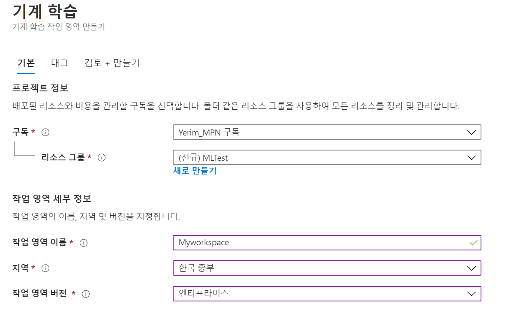
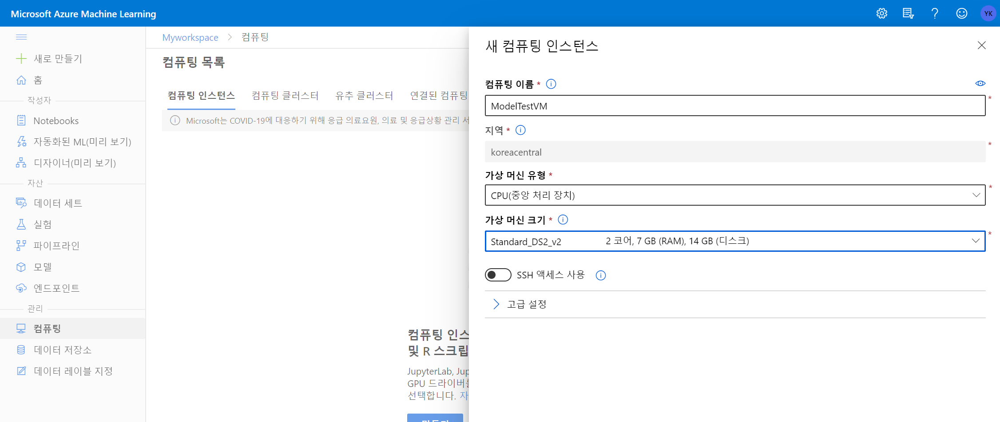
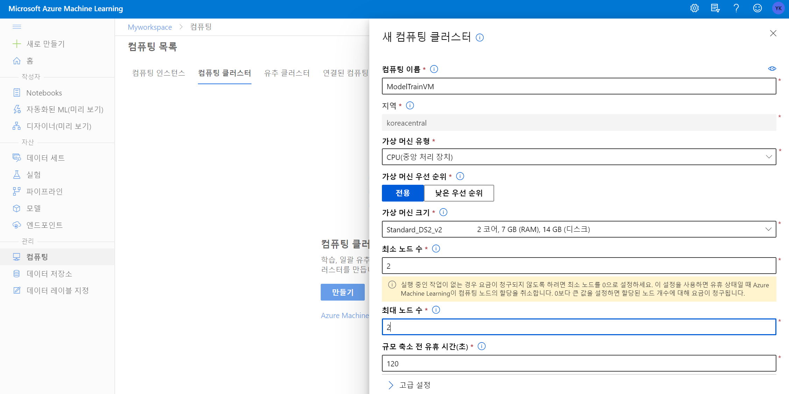
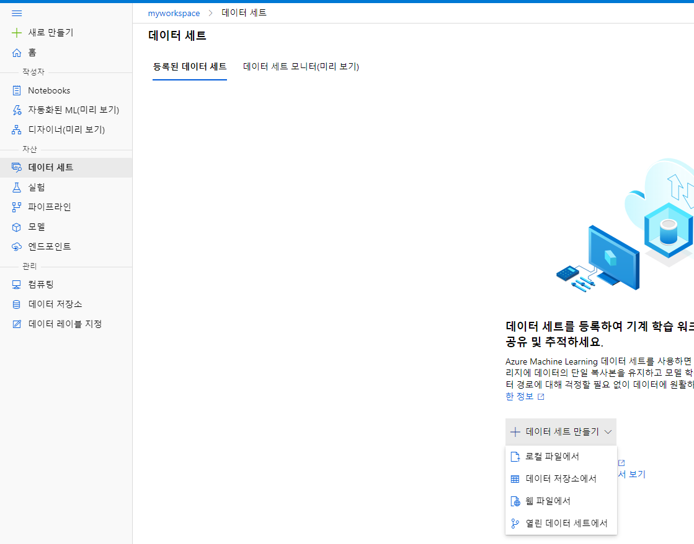
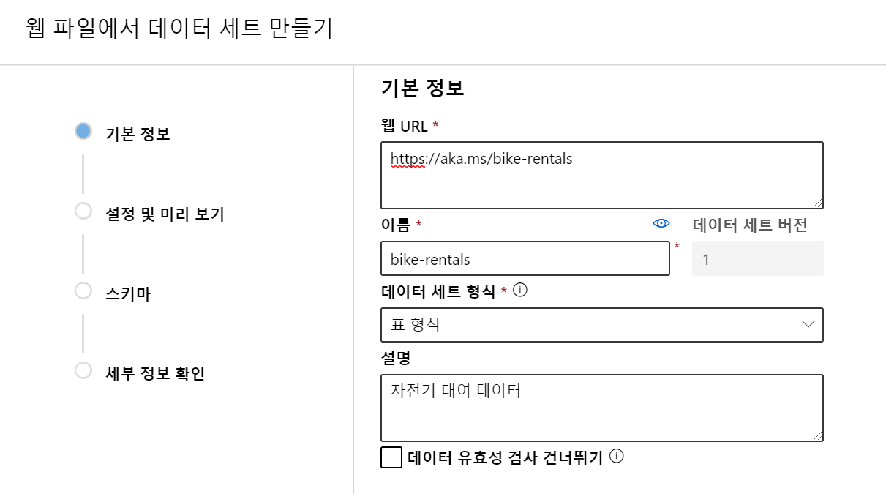
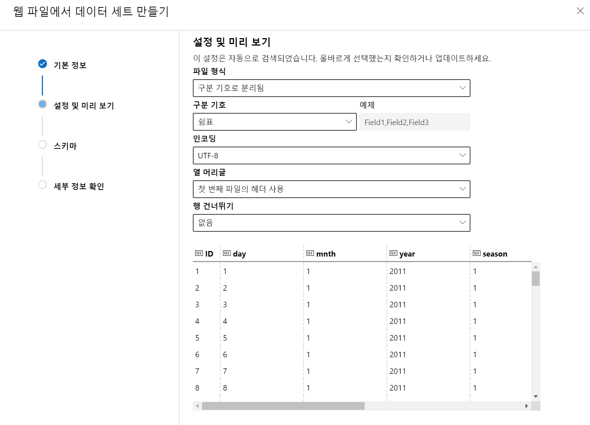
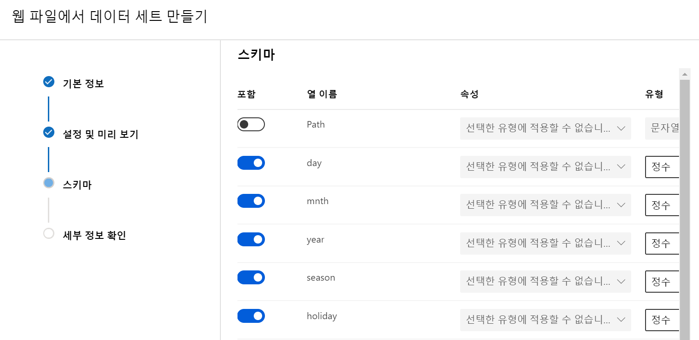
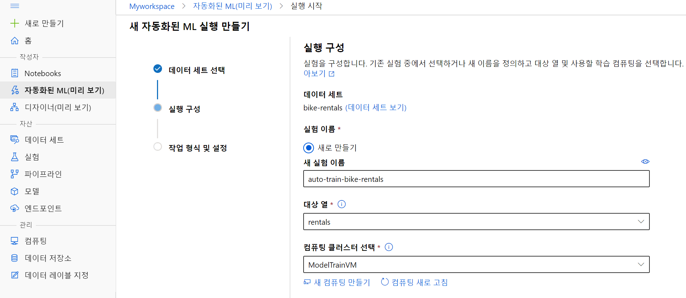
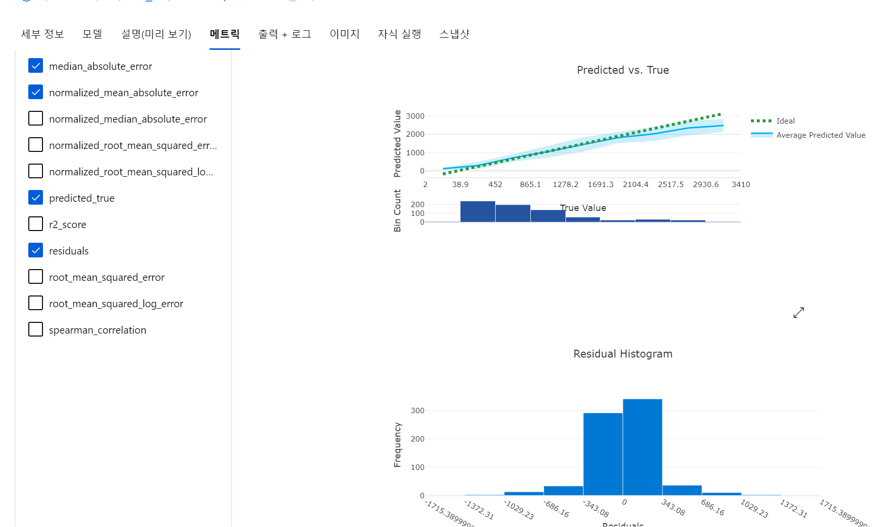

---
authors:
- yerim kim
date: "2020-08-19T00:00:00Z"
tags:
- Azure
- Microsoft Azure
- Data Science
- Machine Learning
title: 데린이의 Azure Machine Learning 실습
---

이번 포스팅은 [Azure Machine Learning 실습 자료](https://docs.microsoft.com/learn/modules/use-automated-machine-learning/)를 바탕으로 작성하였습니다. 해당 모듈은 Azure Machine Learning을 사용하여 코드 없이 예측 모델 만들기 실습의 첫 번째 모듈입니다.

다양한 머신러닝 모델을 알아보고, Azure Machine Learning의 자동화된 머신러닝 기능을 사용하여 예측 모델을 학습하고 배포하기 위한 실습입니다.

### 1. What is machine learning?

머신러닝은 알려지지 않은 값을 예측하기 위해 수학과 통계를 사용하는 기술입니다. 머신러닝 모델을 하나 이상의 연산을 수행하는 함수로 이해할 수 있습니다. 예를 들어 도시에 자전거 대여 회사가 있다고 가정해봅시다. 날짜별, 요일별, 날씨별 데이터를 바탕으로 자전거 대여 수요를 예측해 필요한 직원과 자전거 수를 조절하려고 합니다. 한 주의 특정한 요일이나 날씨같은 세부 정보를 X로 둘 수 있고, 그 날의 대여량을 Y로 둘 수 있습니다. 해당 정보에 따라 대여량을 계산하는 함수 F 는 머신러닝 모델 안에 있습니다.

> Y = F(X)

### 2. Azure Machine Learning

머신러닝 모델을 효율적으로 학습시키고 배포하는 데에는 많은 시간과 자원이 듭니다. 머신러닝 모델 학습에 사용하는 대부분 데이터는 선가공이 필요합니다. 또한 데이터 과학자들은 정확한 모델을 만들기 위해 다양한 모델 학습 알고리즘을 시도합니다. 이 과정에서 비싼 컴퓨팅 하드웨어를 비효율적으로 사용하게 됩니다.

Azure Machine Learning은 데이터 과학자들이 데이터를 준비하고, 모델을 학습시키고, 예측 서비스를 배포하는 등 작업을 간단히하여 시간을 단축할 수 있도록 도와주는 클라우드 기반 서비스입니다. 데이터 과학자들이 데이터를 준비하고 모델을 학습하고 예측 서비스를 배포하고 사용량을 모니터링하기 위한 다양한 기능을 제공합니다. 많은 시간을 소요하는 모델 학습과 관련한 일을 자동화함으로써 일의 효율성을 높일 수 있습니다. 또한, Azure Machine Learning을 사용하면 많은 데이터를 효율적으로 확장할 수 있으며, 사용할 때만 과금하는 정책을 통해 비용을 절약할 수 있습니다.

### 3. Create an Azure Machine Learning Workspace

Azure Machine Learning을 사용하기 위해서 Azure 구독에 Workspace를 생성합니다. Workspace에서 데이터, 컴퓨트 자원, 코드, 모델, 그리고 머신러닝 워크로드와 관련한 다양한 아티팩트를 관리할 수 있습니다. 

**참고 :** Azure Machine learning은 2020년 8월 기준 Enterprise와 Basic 두 가지 버전을 제공합니다. Basic 버전은 GA로 사용 가능하며, Enterprise Edition은 미리보기 상태입니다. 이 기간에는 ML 추가 요금이 없습니다. Enterprise Edition은 UI, Azure ML 디자이너, 작업 영역 간 용량 공유 및 할당량 지정 등 기능을 추가 제공합니다. 

(1) Azure Portal에서 *Machine Learning(기계 학습)* 리소스를 만듭니다.

(2) 리소스 배포가 완료되면 Machine Learning Studio를 엽니다.  - https://ml.azure.com 로 접속하거나 Portal에서 클릭합니다.

### 4. Create Compute Resources

Azure Machine Learning에서 생성할 수 있는 컴퓨팅 자원은 다음과 같습니다. 
- Compute Instance : 데이터 과학자가 데이터와 모델로 작업할 수 있는 개발 Workstation입니다. 이번 실습에서는 모델을 테스트하기 위해 사용합니다. 
- Compute Clusters : 실험 코드의 온디맨드 처리를 위한 가상머신의 확장성 있는 클러스터입니다. 이번 실습에서는 머신러닝 모델을 학습시키는데 사용합니다. 
- Inference Clusters : 학습된 모델을 사용하는 예측 서비스를 위한 배포 타겟입니다. (AKS를 이용해 배포하려면 해당 컴퓨팅 자원을 생성해야 합니다)
- Attached Compute : 가상머신이나 Azure Databricks 클러스터와 같은 기존 Azure 컴퓨트 리소스를 연결할 수 있습니다.

(1) 모델 테스트 시 Workstation으로 사용할 Compute Instance를 생성합니다. 

(2) 모델을 학습시키는데 사용할 Compute Cluster를 생성합니다.

**참고 :** 프로덕션 환경에서는 최소 노드 수를 0으로 설정하여 필요한 경우에만 컴퓨팅 자원을 시작하도록 합니다. VM을 시작하는데 시간이 걸리므로 이 모듈에서는 기다리는 시간을 최소화하기 위해 2개의 노드를 계속 동작하도록 설정합니다. 불필요한 과금을 방지하려면 실습을 진행하지 않을 때는 최소 노드 수를 다시 0으로 조절하는 것이 좋습니다. 또는 빠르게 실습을 진행한 후 리소스 그룹을 삭제합시다.

### 5. Explore data

머신러닝 모델에 넣을 데이터가 필요합니다. Microsoft에서 제공하는 데이터를 이용합니다. 자전거 대여 세부사항 데이터셋을 사용하여 계절 및 기상학적 특징을 기준으로 특정 날짜의 자전거 대여 횟수를 예측하는 모델을 학습시킬 것입니다. 

(1) 데이터 세트를 만듭니다. 

*로컬 파일에서 / 데이터 저장소에서 / 웹 파일에서 / 열린 데이터 세트에서* 옵션이 있습니다. 여기서는 웹(https://aka.ms/bike-rentals)에서 데이터를 불러옵니다.

**참고 :** 데이터 저장소는 Azure Blob Storage, Azure 파일 공유, Azure Data Lake Storage Gen1, Azure Data Lake Storage Gen2, Azure SQL Database, Azure PostgreSQL 데이터베이스를 지원합니다.

**참고 :** 열린 데이터세트란 [Azure에서 제공하는 개방형 데이터 세트](https://azure.microsoft.com/ko-kr/services/open-datasets/)를 말합니다. 

(2) 만들어진 데이터 세트를 검토합니다. 

### 6. Train a machine learning model

Azure Machine Learning은 클라우드 컴퓨팅의 확장성을 활용하여 다중 전처리 기법과 모델 학습 알고리즘을 병렬로 사용해 데이터에 가장 적합한 모델을 찾는 자동화된 머신러닝 기능을 포함하고 있습니다. 

자동화된 머신러닝 *experience*를 구성합니다. (해당 기능은 아직 Preview 상태입니다.)

(1) 데이터 세트를 선택하고, 대상 열로 *rentals*를 지정합니다. 우리는 이 실험을 통해 자전거 대여량을 예측할 것입니다. 학습에 사용할 컴퓨팅 클러스터로 앞서 만든 클러스터를 지정합니다. 

(2) 작업 형식을 *회귀*로 선택하고, 추가 구성을 설정합니다. *RandomForest*와 *LightGBM*을 빼고 모든 알고리즘을 차단합니다. 보통은 이렇게 하지 않지만 학습에 너무 오랜 시간이 소요되기 때문에 다음과 같이 구성합니다. 

**참고 :** 회귀분석(Regression Test)이란?
독립 변인이 종속 변인에 영향을 미치는지 알아보고자 할 때 실시하는 분석 방법입니다. 단순 선형 회귀 분석은 독립변수 X(설명변수)에 대하여 종속변수 Y(반응변수)들 사이의 관계를 수학적 모형을 이용하여 규명하는 것입니다. 

(3) 기능화(Featurization) 사용을 체크합니다.

**참고 :** 방대한 데이터에서 어떤 feature가 유용한지 아닌지 확인하는 작업이 필요합니다. 이 과정을 특징 선택(feature selection) 또는 특징 추출(feature extraction)이라고 합니다. Azure에서는 데이터 정규화, 누락된 데이터 처리, 텍스트를 숫자로 변환하는 작업을 자동으로 수행합니다.

세부 사항 설정을 마치면 자동으로 학습이 시작됩니다. 

### 7. Review the best model

(1) 세부 정보 탭에서 최적의 모델을 검토할 수 있습니다. 

최적 모형은 지정한 평가 메트릭(정규화된 제곱 평균 오차)을 기반으로 식별됩니다. 이 메트릭을 계산하기 위해서 일부 데이터를 사용해 모델을 학습시킨 후, 학습에 사용되지 않은 데이터로 테스트를 진행합니다. cross-validation 기법을 적용해 예측 값과 실제 값을 비교합니다. 비교한 결과로 나온 오차를 제곱하여 평균을 구한 다음 제곱근을 구합니다. 이 값이 작을수록 모형의 예측도가 높은 것입니다.

(2) 메트릭 탭에서 실제 값과 예측 값을 비교하여 시각화한 자료를 검토할 수 있습니다. 

> Predicted vs True 그래프에서는 모델의 평균 예측 값 그래프가 실제 값에 가까울수록 좋은 성능을 가진 모델임을 의미합니다. 

> Redisual Histogram은 예측 값과 실제 값 사이의 분산을 나타냅니다. 0쪽에 값이 군집되어 있다는 것은 실제 값과 예측 값의 차이가 0인 경우가 많았다는 의미입니다.

(3) 설명 탭에서 Global Importance 차트를 볼 수 있습니다. 이는 dataset 내의 어떤 feature가 모델의 예측에 가장 많은 영향을 줬는지 보여줍니다. 

모델을 만들었으면 성능이 가장 좋은 모델을 배포해야 합니다. Azure Machine Learning에서는 ACI(Azure Container Instance)나 AKS(Azure Kubernetes Service) 클러스터에 서비스를 배포할 수 있습니다. 프로덕션 시나리오에서는 Inference Clusters를 생성하여 AKS에 배포하는 것이 권장됩니다. 실습에서는 ACI를 이용해 배포하는 방법을 소개하고 있습니다. 
다음 모듈 실습에서 배포 방법에 대해 다루도록 하겠습니다. 

https://docs.microsoft.com/learn/modules/use-automated-machine-learning/deploy-model

자동화된 머신러닝 기능은 현재 미리보기 기능으로 제공됩니다. 향후 GA로 전환될 경우 여러가지 머신러닝 모델을 빠르게 적용하여 최적의 모델을 찾아야 하는 고객에게 유용한 기능이 될 것 같습니다. 많은 데이터에서 유용한 feature를 찾아내고, 분석 목적에 맞게 데이터를 전처리하는 작업도 제공하기 때문에 데이터 과학자가 데이터로부터 의미 있는 인사이트를 도출해내는 일에 더 집중할 수 있습니다.

