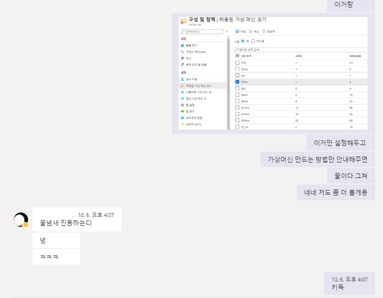
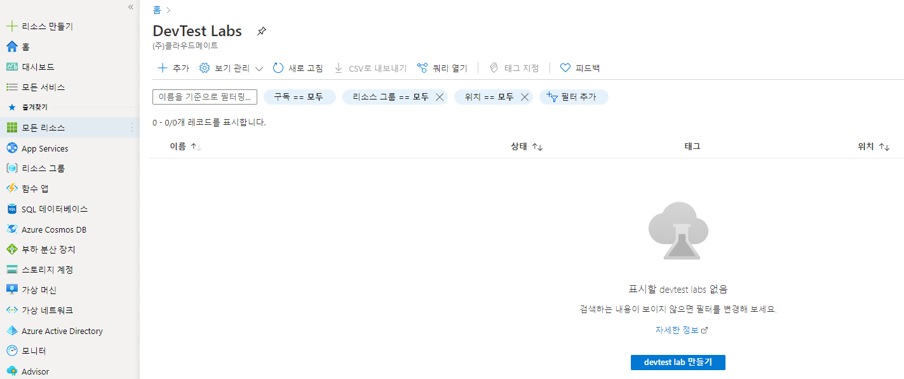
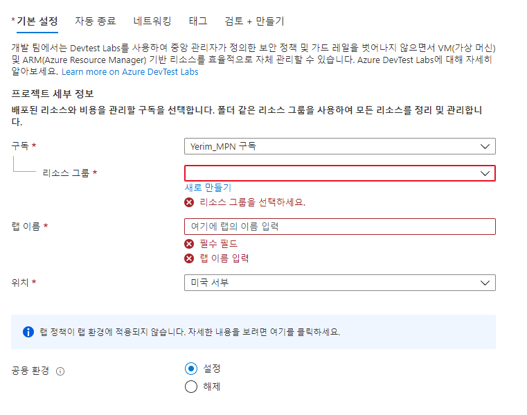
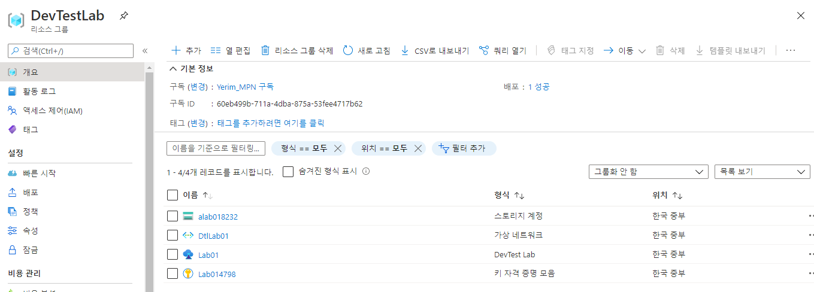
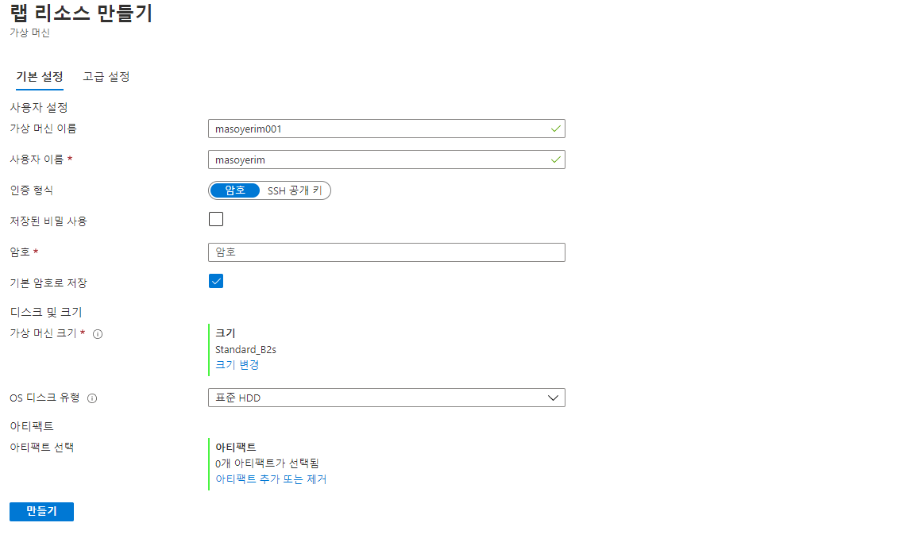
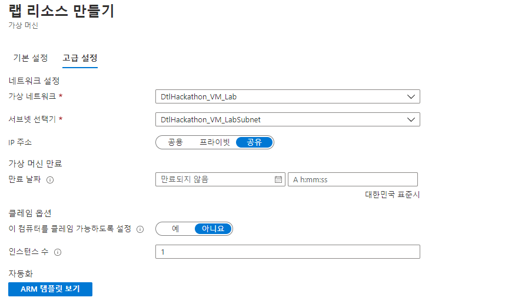

---
authors:
- yerim kim
date: "2020-10-15T00:00:00Z"
tags:
- Azure
- Microsoft Azure
- Dev Test Labs
title: 해커톤 참가자들에게 VM 77개 배포하기- DevTest Labs 사용기
---

171명 77팀을 대상으로 온라인 해커톤이 진행됐다. 우리 회사에서는 VSCodeSpace 기반 공동 개발 환경을 안내하고, 팀별 프로덕트 배포 및 데이터베이스 설치를 위한 VM을 제공해야 했다. 효율적인 리소스 관리를 위해 VM을 미리 만들어서 접속 경로만 배포하기로 했다.

77팀이니까 77개 그룹을 생성해서 팀별로 나누고, 리소스 그룹을 77개 만들어서 접근 권한을 부여하고, ARM 템플릿과 Azure CLI를 사용해 VM을 77개 배포하고, 그 결과로 생성된 사용자 계정, 패스워드, 공용 IP 77개를 각 팀에 전달하면 끝나는 작업이었다. 

자동화 스크립트를 짜서 77번 작업을 몇 번의 코드 실행으로 끝낼 수도 있지만, 어디서부터 자동화를 시작해야 할지, 생성 시 설정한 계정과 생성된 IP를 어떻게 매핑해야 하는지가 과제였다. 또, VM을 자동으로 종료하고 시작하는 정책도 부여하고 싶었다. 자동 종료는 VM 생성 시 설정할 수 있지만, 자동 시작을 설정하려면 Azure Automation 같은 다른 방법을 생각해야 했다.

자동화를 도와주실 우리팀 개발자(기린님)와 함께 고민하던 중, Azure 자격증 시험에 나왔던 [DevTest Labs](https://azure.microsoft.com/ko-kr/services/devtest-lab/)가 떠올랐다.(AZ-900이었나 AZ-103이었나 생각은 잘 안난다) 

*Q. (대략 이런 문제) 테스트를 위해 개발자들에게 대량 배포한 VM을 지정된 시간에 종료해야 한다. 어떤 서비스로 VM을 배포하는게 적합할까? - **DevTest Labs***

꿀냄새를 맡고 테스트를 해보니, 딱 우리를 위한 것이었다. DevTest Labs는 개발 및 테스트를 위한 환경을 개발자가 직접 프로비전할 수 있도록 하고, 정책을 통해 비용 관리를 간소화할 수 있는 서비스다. 관리자가 미리 배포해놓은 VM을 클레임하여 사용할 수도 있고, 미리 정의한 정책대로 사용자가 VM을 직접 생성할 수도 있다. 

> 이렇게 하면, 중앙에서 관리자가 정의한 보안 및 크기 정책을 벗어나지 않으면서 개발자가 직접 VM이나 리소스를 배포하고 관리할 수 있다. 

DevTest Labs에서 설정할 수 있는 정책은 다음과 같다. 
- 허용된 가상 머신 크기
- 사용자당 가상 머신 수
- 랩당 가상 머신 수
- 가상 머신을 만들 리소스 그룹
- 자동 종료 및 자동 시작 정책
- 가상 머신 기본 이미지

이 서비스를 이용하면 앞서 논의했던 77번 작업을 자동화할 필요가 없었다. 할 일은 간단해졌다. 

1. DevTest Labs를 만든다.
2. 정책을 설정한다. 
3. 해커톤 참가자들에게 **DevTest Labs 사용자** 권한을 부여한다. 
4. Azure Portal에 접속하여 미리 정의한 정책대로 VM을 만드는 방법을 안내한다. 

## DevTest Labs 배포
이제 DevTest Labs를 배포하고 정책을 설정하는 방법을 알아보자.

Azure 포털에서 DevTest Labs를 검색하여 Lab을 생성한다. 
기본으로 지정해야 하는 것은 구독과 리소스그룹, 랩 이름, 배포할 리전이다. 

여기서 공용 환경 사용을 설정하거나 해제할 수 있는데, 공용 환경 리포지토리를 사용하면 랩 사용자가 웹앱이나 SQL 같은 PaaS 리소스를 만들 수 있는 ARM 템플릿 목록을 제공한다. VM만 배포하고 다른 PaaS 리소스 배포를 제한하려면 공용 환경을 해제하면 된다. 

VM은 기본적으로 같은 네트워크의 동일한 서브넷에 배포되고, 네트워크 보안그룹 없이 자동 생성된다. 기존에 만들어놓은 가상 네트워크나 서브넷을 선택할 수도 있다. 보안 그룹은 따로 생성하여 서브넷에 연결하면 된다. 

스토리지 계정, Azure Key Vault, 가상 네트워크가 함께 생성된다. Azure Key Vault는 VM 생성 시, 패스워드를 저장할 수 있는 옵션에서 사용할 수 있다. 스토리지 계정과 Key Vault를 삭제해본 결과, DevTest Labs 사용에는 별다른 문제가 생기지 않았다. 또한, **DevTest Labs 사용자** 역할을 할당받은 사용자는 DevTest Labs 리소스에만 접근할 수 있다. 

## 정책 설정

배포가 완료되면, 왼쪽 **구성 및 정책**에서 세부 정책을 설정할 수 있다. IAM으로 사용자에게 **'DevTest Labs 사용자'**라는 기본 역할을 할당하고, VM을 만들고 시작하는 데 필요한 정책을 설정할 수 있다. 

해커톤 진행을 위해 팀장에게 **DevTest Labs 사용자** 역할을 할당하고, 가상 머신 수를 사용자당 1개로 제한했다.

관리자가 자동 종료 정책을 설정해 놓으면, 사용자가 만드는 모든 VM에 자동 적용된다. 자동 시작 정책 역시 관리자가 설정할 수 있지만, 사용자가 VM에 해당 정책을 적용해야 한다.

## 사용자가 직접 VM을 배포한다면

만약 사용자가 VM을 생성하는 과정이 복잡했다면, DevTest Labs를 사용하는 것을 망설였을 것이다. 관리자가 정책을 설정하고 나면 사용자가 VM을 생성하는 과정은 매우 간단해진다. 게스트 계정으로 초대된 사용자가 DevTest Labs에서 VM을 만드는 과정을 알아보자. 

> 사용자가 리소스 그룹에 접근하면, 네트워크나 Key Vault는 보이지 않는다.

메뉴 구성은 관리자 메뉴와 다르지 않지만, **구성 및 정책**을 바꿀 수 없게 되어있다. 

***클레임 가능한 가상 머신***은 관리자가 미리 만들어둔 VM에서 가용 VM을 클레임해서 사용할 수 있는 메뉴다. ***내 가상 머신***은 직접 생성한 VM을 볼 수 있고, ***모든 가상 머신***은 랩 내 다른 사용자의 VM을 볼 수 있다. 그렇다고 다른 사용자의 VM을 삭제할 수는 없다. 

**+ 추가**를 클릭하여 VM을 생성해보도록 하자.

처음 보이는 것은 관리자가 지정해놓은 이미지다. 선택의 여지가 없으므로 Unbuntu 이미지를 클릭한다. 

다음으로 나오는 화면이다. 가상 머신 크기는 미리 정해진 크기로만 생성할 수 있다. OS 디스크 유형은 사용자가 선택할 수 있지만, 만약 관리자가 '프리미엄 OS 디스크를 사용하는 가상 머신 수'를 0개로 지정해놓았을 경우 프리미엄 OS 디스크를 사용할 수 없다.  

고급 설정 탭으로 가면 가상 네트워크와 서브넷 선택기가 있지만, 마찬가지로 랩 관리자가 설정한 대로 생성해야 한다. 여기서 중요한 것은 IP 주소인데, 공용과 프라이빗은 일반적으로 알고 있는 Public IP와 Private IP를 각각 가진 VM을 생성한다. 특이한 점은 **공유** 선택지다. IP 주소를 **공유**로 만들면, VM에 포트 번호가 할당되고 L4 로드밸런서와 가용성 집합이 자동 생성된다. 

> **공유로 만든 VM들은 모두 같은 리소스 그룹에 생성되고, 리소스 그룹 내 VM들이 단일 IP 주소를 공용으로 사용하게 된다.**

컴퓨터를 클레임할 수 있도록 설정하면, 다른 랩 사용자가 해당 VM을 할당받아 사용할 수 있도록 허용한다. 

생성한 VM을 DevTest Labs **내 가상 머신** 목록에서 확인할 수 있다. VM 리소스(디스크, VM, 네트워크 인터페이스, 공용 IP 주소)는 별도 리소스 그룹에 생성되며, 관리자만 확인할 수 있다. 

생성된 VM을 클릭한 화면이다. FQDN을 확인할 수 있고, 관리자가 설정한 자동 시작 정책을 옵트인 할 수 있다. 

## DevTest Labs 장점

테스트를 진행하면서 느낀 장점은 
- 정책 설정 및 관리가 쉽다. 
- 사용자가 VM을 생성하는 과정이 비교적 쉽다.
- 사용자가 VM외 다른 리소스(네트워크, 키볼트, 네트워크 인터페이스 등)에 접근할 수 없다. 

## DevTest Labs 단점

물론 단점도 있다. 
- VM 생성이 느리다. (최대 10분 소요)
- 직접 VM을 만들어서 배포하는 것보다는 사용자 책임이 크고, 가이드 할 요소가 많다. 

DevTest Labs는 테스트 환경을 대량 배포해야 할 상황에서 유용하게 사용할만한 서비스다. 사용자에 대한 권한이나 정책을 비교적 쉽게 할당하고 관리할 수 있기 때문에 관리자의 수고를 덜면서 사용자가 VM을 요청하고 생성하는 과정을 간소화할 수 있다. 