안녕하세요, 클라우드메이트 배지수입니다.

전자제품에 사후관리(A/S)가 중요하듯이, IT 서비스도 초기 구성 이후의 관리와 운영은 서비스 수준을 평가하는 데 있어 매우 중요한 부분입니다. 이를 위해서는 서비스를 평가하는 각종 메트릭을 지속적으로 수집해야 하고, 이 수집 절차를 구성하는 것 또한 서비스 구성의 일부가 됩니다. AWS에서는 CloudWatch라는 서비스를 통해 각 서비스의 상태와 기능 및 성능을 모니터링하여 사용자에게 제공하고 있습니다.

이번 시간에는 Linux 서버에서 AWS CloudWatch를 통해 프로세스 모니터링하고 재시작을 자동화하는 방법을 구성해 보고 테스트해 보는 과정에서 정리했던 내용들을 공유하고자 합니다. 가볍게 읽어주시면 감사하겠습니다.

---

##### "모니터링으로부터 시작되는 자동화"

AWS CloudWatch는 CloudWathch 알람을 통해 알람 발생 시 EC2 인스턴스를 재시작하는 동작은 제공하지만, 인스턴스 안에서 실행되고 있는 프로세스를 재시작하는 기능은 제공하고 있지 않습니다.

따라서 EC2 인스턴스 내에 CloudWatch Agent를 설치하여 프로세스에 대한 메트릭을 수집하고 SSM Agent를 설치하여 원격으로 프로세스를 다시 시작하는 명령어를 실행할 수 있도록 자동화를 구성하였습니다. 그리고 Slack으로 해당 메시지를 수신하는 기능을 추가하였습니다. 처음에는 몇 가지 서비스의 특징적인 기능만 떠오르고 큰 그림을 그리기가 어려웠지만 동료분들을 괴롭히면서 당근을 좀 쥐어줬더니 괜찮은 아이디어가 나왔습니다.

구성도 및 방법은 다음과 같습니다.


1. EC2 인스턴스에서 동작하는 프로세스가 다운되면 CloudWatch 알람이 발생합니다.
1. SNS를 통해 Lambda 함수를 호출하여 자동으로 프로세스를 재시작합니다.
1. AWS Chatbot에 연동된 Slack으로 알람을 보냅니다.

---

##### "구성 서비스"

먼저 해당 구성에 이용한 AWS 서비스에 대해 간단히 설명하겠습니다.

**1. CloudWatch Agent**

CloudWatch에서는 AWS에 사전에 정의된 메트릭과 사용자가 설정한 메트릭을 사용할 수 있습니다.  
EC2 인스턴스를 기준으로 CPU, Network, Disk IO 등 리소스에 대한 모니터링 메트릭이 사전에 정의되어 있습니다. 그 밖에 프로세스나 RAM 같은 추가적인 시스템 단계 메트릭은 EC2 인스턴스 내에 추가적으로 Agent를 구성하여 수집 및 모니터링이 가능합니다.

CloudWatch Agent는 Hypervisor 영역에서 확인할 수 없는 메트릭을 수집하며 CloudWatch Logs에 로그를 보내는 역할을 하며 CloudWatch Agent를 EC2 인스턴스나 Linux 서버에 설치하면 다음과 같은 메트릭을 수집할 수 있습니다.
- CPU (active, guest, idle, system, user, steal)
- Disk metrics(free, used, total), Disk IO(writes, reads, bytes, iops)
- RAM (free, inactive, used, total, cached)
- Netstat (number of TCP and UDP connections, net packets, bytes)
- Swap Space (free, used, used %)

**2. Procstat Plugin**
- Procstat Plugin은 CloudWatch Agent 구성 파일의 metrics_collected 섹션에 procstat 섹션을 추가하여 사용하며 개별 프로세스의 메트릭을 수집합니다.
- Procstat Plugin이 수집하는 메트릭은 다음 링크에서 확인하실 수 있습니다.[[1]](https://docs.aws.amazon.com/ko_kr/AmazonCloudWatch/latest/monitoring/CloudWatch-Agent-procstat-process-metrics.html)


**3. CloudWatch 알람**
- CloudWatch 알람은 메트릭에 대한 임계치와 조건을 정의하여 알람을 트리거합니다. CloudWatch 알람은 SNS(Simple Notification Service)와 연동하여 작동하며 IT 인프라의 장애 혹은 특이사항을 알람으로 받을 수 있습니다. 
- 메트릭의 수치가 등록한 임계치에 포함되지 않을 경우 알람에 따라 자동으로 동작하는 후속 조치를 정의할 수 있다면 IT 인프라 관리자는 24/7 인프라를 모니터링해야 할 필요가 없어지며 시간과 노력을 절약할 수 있고 이는 자원의 효율적인 활용과 더불어 서비스의 품질 향상에도 큰 보탬이 될 것입니다.

**4. Amazon SNS**
- SNS(Simple Notification Service)는 AWS의 푸시 알림 서비스로 HTTP/S, Email, SMS, IT/Mobile Device 그리고 AWS 인프라를 타겟으로 메시지를 전달할 수 있습니다.

**5. SSM Agent**
- AWS SSM Agent(Systems Manager Agent)는 Systems Manager 요청을 처리하고 요청에 지정된 대로 시스템을 구성합니다.
- SSM Agent는 최근 AWS에서 자주 사용하고 있는 Amazon Linux, Amazon Linux 2, Amazon Linux 2 ECS 최적화 기본 AMIs, SUSE Linux Enterprise Server(SLES) 12 및 15, Ubuntu Server 16.04, 18.04 및 20.04 AMI에 기본적으로 설치되며 이외의 Linux AMIs에서 생성된 EC2 인스턴스에서는 SSM Agent를 수동으로 설치 및 구성하여야 합니다.
- 또한 인스턴스가 Systems Manager 서비스의 핵심 기능을 사용하는 것을 허용하도록 인스턴스 프로필에 정책 AmazonSSMManagedInstanceCore에 대한 권한을 추가해야 합니다.[[2]](https://docs.aws.amazon.com/systems-manager/latest/userguide/setup-instance-profile.html#instance-profile-add-permissions)
   

**6. SSM Run Command**
- Run Command는 AWS Systems Manager의 기능으로 해당 EC2 인스턴스에 접속하여 직접 명령어를 입력하지 않고 원격으로 명령어를 실행하는 기능을 합니다. 
- 일반적인 관리 테스크를 자동화하고 대규모로 일회성 구성 변경을 수행할 수 있어 보통 원격으로 업데이트 작업이나 다수의 인스턴스에 하나의 명령어를 실행하는 경우에 많이 사용됩니다.

**7. AWS Lambda**
- Lambda는 가상의 함수로 관리할 서버 없이 코드를 프로비저닝하면 함수가 실행되는 AWS의 서버리스 서비스입니다. 
- 다양한 언어를 지원하며 여러 AWS 서비스와 통합되어 CloudWatch와도 쉽게 모니터링을 통합할 수 있다는 장점이 있습니다.

**8. AWS Chatbot**
- AWS Chatbot이란 Slack 및 Amazon Chime을 채팅 클라이언트로 지원하는 대화형 Agent로 Amazon SNS 주제를 통해 여러 AWS 서비스와 통합됩니다. AWS Chatbot을 사용하면 AWS 환경에서 실행되는 애플리케이션에 대한 최신 이벤트를 놓치지 않고 수신하고 이에 대응하여 신속하게 조치 및 해결할 수 있습니다.

---

##### "구성 방법"

#### 1️⃣ Amazon EC2 인스턴스에 통합 CloudWatch Agent와 SSM Agent를 설치합니다.


🔷 **IAM 역할**  

먼저 EC2 인스턴스에서 CloudWatch Agent를 실행하기 위해서는 EC2 인스턴스의 IAM 역할에 정책 CloudWatchAgentServerPolicy에 대한 권한이 필요합니다. 추가로 Agent가 CloudWatch Logs에 로그를 전송하고 Agent가 이러한 로그 그룹에 대한 보존 정책을 설정할 수 있도록 하려면 IAM 역할에 logs:PutRetentionPolicy 권한을 부여해야 합니다.[[3]](https://docs.aws.amazon.com/AmazonCloudWatchLogs/latest/APIReference/API_PutRetentionPolicy.html)


위에서 생성한 역할을 EC2 인스턴스에 연결합니다.


🔷 **CloudWatch Agent**

1. CloudWatch Agent 다운로드  
- CloudWatch Agent는 Amazon Linux 2에서 패키지로 사용할 수 있으며 다음 명령어를 입력하여 설치합니다.
```linux
sudo yum install amazon-cloudwatch-agent
```
2. CloudWatch Agent 구성 파일 생성 및 수정  
- CloudWatch Agent를 다운로드한 후 서버에서 Agent를 시작하기 전에 구성 파일을 생성해야 합니다.
- Agent 구성 파일은 사용자 지정 지표를 포함하여 Agent가 수집해야 하는 지표 및 로그가 지정되어 있는 JSON 파일로 마법사를 사용하거나 Scratch에서 직접 생성하여 구성 파일을 생성할 수 있습니다.
- 마법사를 사용해서 Agent 구성 파일을 생성 및 수정하였으며 방법은 다음과 같습니다.[[4]](https://docs.aws.amazon.com/ko_kr/AmazonCloudWatch/latest/monitoring/create-cloudwatch-agent-configuration-file-wizard.html)
- 다음 명령어를 입력하여 CloudWatch Agent 구성 마법사를 시작합니다.

```linux
sudo /opt/aws/amazon-cloudwatch-agent/bin/amazon-cloudwatch-agent-config-wizard
```

- 질문에 답하며 서버의 구성 파일을 사용자 정의합니다.

#### 2️⃣ 통합 CloudWatch Agent에서 Procstat Plugin을  사용하여 프로세스 지표를 수집합니다.  
🔷 **CloudWatch Agent 구성 파일**

1) CloudWatch Agent 구성 파일 수정
- 다음 명령어를 입력하여 구성 파일을 엽니다.

```linux
vim /opt/aws/amazon-cloudwatch-agent/bin/config.json
```
- Procstat Plugin을 사용하기 위하여 CloudWatch Agent 구성 파일의 metrics_collected 섹션에 procstat 섹션을 추가합니다.[[5]](https://docs.aws.amazon.com/ko_kr/AmazonCloudWatch/latest/monitoring/CloudWatch-Agent-procstat-process-metrics.html)
- exe는 정규식 일치 규칙을 사용하여 프로세스 이름이 지정한 문자열과 일치하는 프로세스를 선택합니다. measurement는 수집할 메트릭의 배열을 지정하며 여기에 프로세스의 실행 수를 의미하는 pid_count를 추가합니다.
- 다음 예제의 procstat 섹션은 문자열 httpd와 이름이 일치하는 모든 프로세스를 모니터링하며 각 프로세스에서 동일한 지표가 수집됩니다.

```linux
"procstat": [
                  {
                                "exe": "httpd",
                                "measurement": "pid_count"
                  }
                ]
```

- 프로세스를 다운로드 받고 실행합니다.

```linux
sudo yum -y install httpd
sudo systemctl start httpd
```

- CloudWatch Agent 설정 값을 저장하고 재실행합니다. CloudWatch Agent 구성 파일을 변경할 때마다 Agent를 다시 시작하여 변경 사항이 적용되도록 해야 합니다.

```linux
sudo /opt/aws/amazon-cloudwatch-agent/bin/amazon-cloudwatch-agent-ctl -a fetch-config -m ec2 -c file:/opt/aws/amazon-cloudwatch-agent/bin/config.json -s
```

#### 3️⃣ CloudWatch 알람을 생성하여 특정 임계치에 도달한 경우 알람이 트리거되며 Amazon SNS를 연동하여 알림을 보냅니다.

🔷 **Amazon SNS**


1) Amazon SNS 주제 생성
- CloudWatch 알람 발생 시 수행될 Amazon SNS 주제를 생성합니다.

- CloudWatch 알람이 해제되어 상태가 정상으로 변경된 경우 수행될 Amazon SNS 주제를 생성합니다.


🔷 **AWS Lambda**


1) Lambda 함수 생성
- CloudWatch 알람 발생 시 동작하는 Lambda 함수를 생성합니다.
- Lambda 함수 생성 시 함수에 대한 권한을 정의하는 IAM 역할이 필요합니다. 기본적으로 Lambda는 Amazon CloudWatch Logs에 로그를 업로드할 수 있는 권한을 가진 실행 역할을 생성하며 이 기본 역할은 나중에 트리거를 추가할 때 사용자 지정이 가능합니다. 정책은 다음과 같습니다.[[6]](https://aws.amazon.com/ko/premiumsupport/knowledge-center/lambda-cloudwatch-log-streams-error/)

```json
{
    "Version": "2012-10-17",
    "Statement": [
        {
            "Effect": "Allow",
            "Action": "logs:CreateLogGroup",
            "Resource": "arn:aws:logs:ap-northeast-2:[Accound ID]:*"
        },
        {
            "Effect": "Allow",
            "Action": [
                "logs:CreateLogStream",
                "logs:PutLogEvents"
            ],
            "Resource": [
                "arn:aws:logs:ap-northeast-2:[Account ID]:log-group:/aws/lambda/jisoo-test-lambda:*"
            ]
        }
    ]
}
```
2) 트리거 추가
- Lambda 함수에 Amazon SNS 주제로의 트리거를 추가합니다.
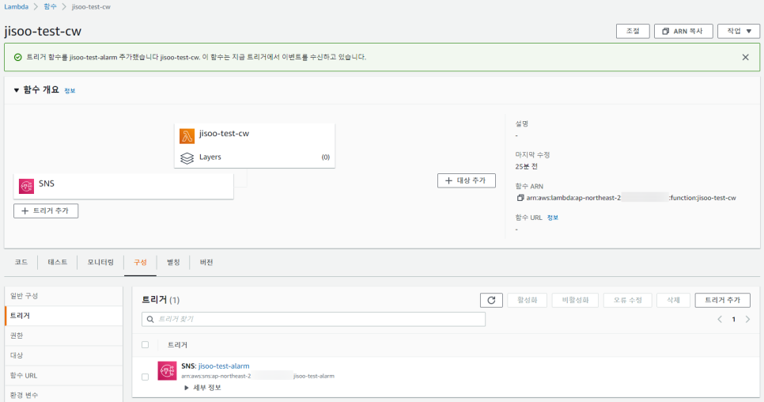

🔷 **CloudWatch 알람**
1) CloudWatch 알람 생성
- 특정 인스턴스에 대한 CloudWatch 메트릭을 모니터링하는 CloudWatch 알람을 생성합니다.

- 1분 동안 특정 인스턴스의 프로세스의 실행 수의 합계가 0보다 작거나 같을 때 자동으로 알람이 발생하도록 지표 및 조건을 지정합니다.

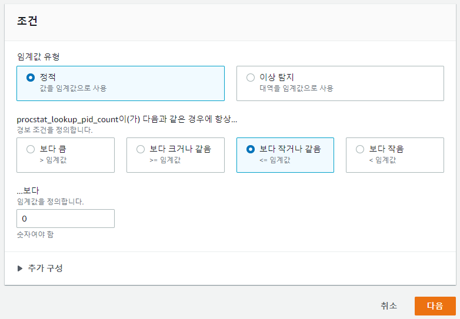
- CloudWatch 알람이 발생한 경우 및 상태가 정상으로 변경된 경우 위에서 생성한 SNS 주제로 해당 알림을 전송하도록 연결합니다.
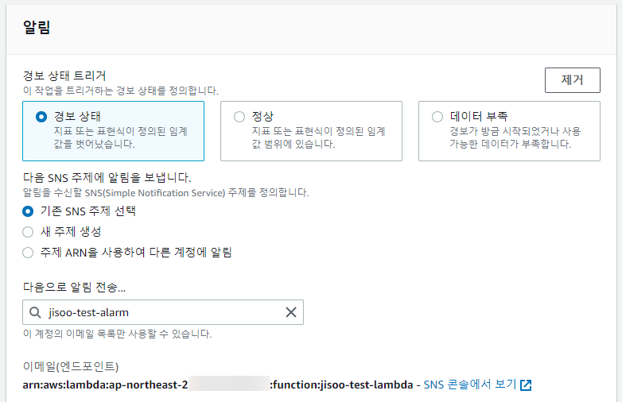
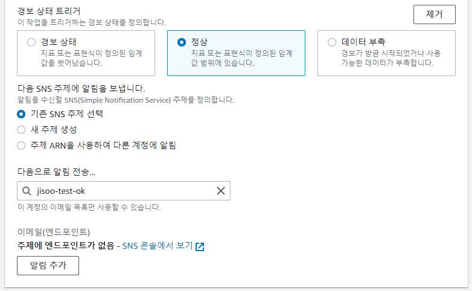
- 다음과 같이 CloudWatch 알람이 생성되었습니다.
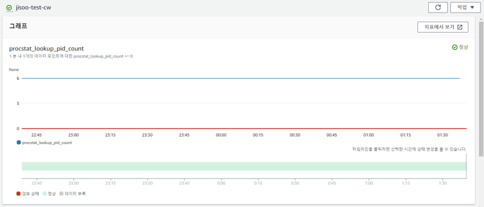
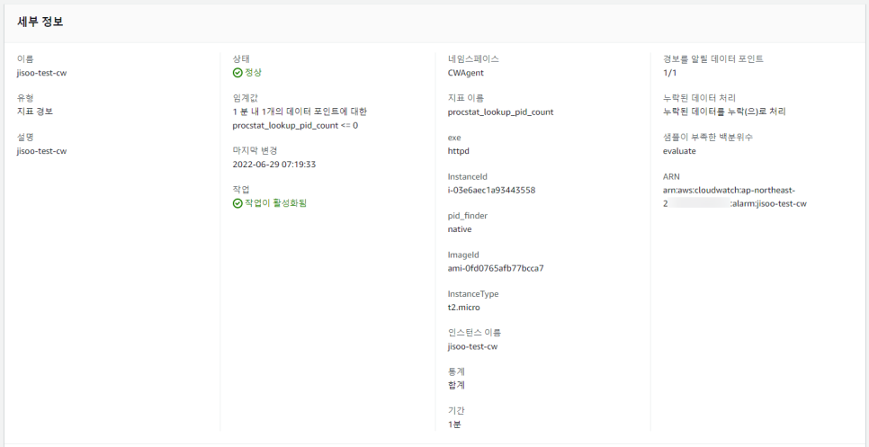

#### 4️⃣ SNS 서비스를 Lambda 함수로 연결하여 EC2 인스턴스 내에서 SSM Agent를 통해 Run Command를 수행하도록 합니다.
🔷 **AWS Lambda**

1) Lambda 함수의 코드를 작성하기 전에 AWS 콘솔 > CloudWatch > Log groups > /aws/lambda/jisoo-test-cw 에서 위에서 생성한 이벤트를 출력해보았습니다.
- 로그 이벤트의 결과는 다음과 같습니다.
```yaml
{'Records': [{'EventSource': 'aws:sns', 'EventVersion': '1.0', 'EventSubscriptionArn': 'arn:aws:sns:ap-northeast-2:[Account ID]:jisoo-test:1081a4ec-a46b-4aff-8de7-51a915148168', 'Sns': {'Type': 'Notification', 'MessageId': '863a960f-5e65-5b50-a9c9-cd3b3c2a7d5c', 'TopicArn': 'arn:aws:sns:ap-northeast-2:[Account ID]:jisoo-test', 'Subject': 'ALARM: "jisoo-test-cw" in Asia Pacific (Seoul)', 'Message': '{"AlarmName":"jisoo-test-cw","AlarmDescription":"jisoo-test-cw","AWSAccountId":"[Account ID]","AlarmConfigurationUpdatedTimestamp":"2022-06-28T01:56:39.773+0000","NewStateValue":"ALARM","NewStateReason":"Threshold Crossed: 1 out of the last 1 datapoints [0.0 (28/06/22 01:55:00)] was less than or equal to the threshold (0.0) (minimum 1 datapoint for OK -> ALARM transition).","StateChangeTime":"2022-06-28T01:57:35.603+0000","Region":"Asia Pacific (Seoul)","AlarmArn":"arn:aws:cloudwatch:ap-northeast-2:[Account ID]:alarm:jisoo-test-cw","OldStateValue":"OK","OKActions":[],"AlarmActions":["arn:aws:sns:ap-northeast-2:[Account ID]:jisoo-test"],"InsufficientDataActions":[],"Trigger":{"MetricName":"procstat_lookup_pid_count","Namespace":"CWAgent","StatisticType":"Statistic","Statistic":"SUM","Unit":null,"Dimensions":[{"value":"httpd","name":"exe"},{"value":"i-03e6aec1a93443558","name":"InstanceId"},{"value":"ami-0fd0765afb77bcca7","name":"ImageId"},{"value":"native","name":"pid_finder"},{"value":"t2.micro","name":"InstanceType"}],"Period":60,"EvaluationPeriods":1,"DatapointsToAlarm":1,"ComparisonOperator":"LessThanOrEqualToThreshold","Threshold":0.0,"TreatMissingData":"missing","EvaluateLowSampleCountPercentile":""}}', 'Timestamp': '2022-06-28T01:57:35.666Z', 'SignatureVersion': '1', 'Signature': 'NQlL27p5fjsZkPrcj9GIyvFAYoT6oAr7Yk2b2rOBAN88kcSj0XfyjhmUNNaYAWT+Mod8KQQnIcfwicHZ3pWyztQx7B3CEnKv3t5IR8SntcvftQ8i09ugAUVb/a/3k/gjmneqezSFqxL5JWJDP4uUKCalP4nGT2ZQwP3G6V9U/XWQSkYjPCEOq+q5mKRR3Wp3vjGeOw23WUHVvaHt8y7uSKcLxvYTUmzmvNny7sujBWp1dGkpEJO50vx2IbDtAMMBdB8zUkKkzWcxwTce+UzsBcTgP/1sZTiChFDl2JxEiOJUesWFURrzl861lI5Gwb3g72m5YL1V+gN1VYdehUSdjQ==', 'SigningCertUrl': 'https://sns.ap-northeast-2.amazonaws.com/SimpleNotificationService-7ff5318490ec183fbaddaa2a969abfda.pem', 'UnsubscribeUrl': 'https://sns.ap-northeast-2.amazonaws.com/?Action=Unsubscribe&SubscriptionArn=arn:aws:sns:ap-northeast-2:[Account ID]:jisoo-test:1081a4ec-a46b-4aff-8de7-51a915148168', 'MessageAttributes': {}}}]}
```
- 가독성을 높이기 위해 소스 코드를 자동으로 정렬해주는 Tabifier라는 사이트를 이용해 코드를 들여쓰기합니다.[[7]](https://tools.arantius.com/tabifier)
```yaml
{
	'Records': [
		{
			'EventSource': 'aws:sns',
			'EventVersion': '1.0',
			'EventSubscriptionArn': 'arn:aws:sns:ap-northeast-2:[Account ID]:jisoo-test:1081a4ec-a46b-4aff-8de7-51a915148168',
			'Sns': {
				'Type': 'Notification',
				'MessageId': '863a960f-5e65-5b50-a9c9-cd3b3c2a7d5c',
				'TopicArn': 'arn:aws:sns:ap-northeast-2:[Account ID]:jisoo-test',
				'Subject': 'ALARM: "jisoo-test-cw" in Asia Pacific (Seoul)',
				'Message': '{"AlarmName":"jisoo-test-cw","AlarmDescription":"jisoo-test-cw","AWSAccountId":"[Account ID]","AlarmConfigurationUpdatedTimestamp":"2022-06-28T01:56:39.773+0000","NewStateValue":"ALARM","NewStateReason":"Threshold Crossed: 1 out of the last 1 datapoints [0.0 (28/06/22 01:55:00)] was less than or equal to the threshold (0.0) (minimum 1 datapoint for OK -> ALARM transition).","StateChangeTime":"2022-06-28T01:57:35.603+0000","Region":"Asia Pacific (Seoul)","AlarmArn":"arn:aws:cloudwatch:ap-northeast-2:[Account ID]:alarm:jisoo-test-cw","OldStateValue":"OK","OKActions":[],"AlarmActions":["arn:aws:sns:ap-northeast-2:[Account ID]:jisoo-test"],"InsufficientDataActions":[],"Trigger":{"MetricName":"procstat_lookup_pid_count","Namespace":"CWAgent","StatisticType":"Statistic","Statistic":"SUM","Unit":null,"Dimensions":[{"value":"httpd","name":"exe"},{"value":"i-03e6aec1a93443558","name":"InstanceId"},{"value":"ami-0fd0765afb77bcca7","name":"ImageId"},{"value":"native","name":"pid_finder"},{"value":"t2.micro","name":"InstanceType"}],"Period":60,"EvaluationPeriods":1,"DatapointsToAlarm":1,"ComparisonOperator":"LessThanOrEqualToThreshold","Threshold":0.0,"TreatMissingData":"missing","EvaluateLowSampleCountPercentile":""}}',
				'Timestamp': '2022-06-28T01:57:35.666Z',
				'SignatureVersion': '1',
				'Signature': 'NQlL27p5fjsZkPrcj9GIyvFAYoT6oAr7Yk2b2rOBAN88kcSj0XfyjhmUNNaYAWT+Mod8KQQnIcfwicHZ3pWyztQx7B3CEnKv3t5IR8SntcvftQ8i09ugAUVb/a/3k/gjmneqezSFqxL5JWJDP4uUKCalP4nGT2ZQwP3G6V9U/XWQSkYjPCEOq+q5mKRR3Wp3vjGeOw23WUHVvaHt8y7uSKcLxvYTUmzmvNny7sujBWp1dGkpEJO50vx2IbDtAMMBdB8zUkKkzWcxwTce+UzsBcTgP/1sZTiChFDl2JxEiOJUesWFURrzl861lI5Gwb3g72m5YL1V+gN1VYdehUSdjQ==',
				'SigningCertUrl': 'https://sns.ap-northeast-2.amazonaws.com/SimpleNotificationService-7ff5318490ec183fbaddaa2a969abfda.pem',
				'UnsubscribeUrl': 'https://sns.ap-northeast-2.amazonaws.com/?Action=Unsubscribe&SubscriptionArn=arn:aws:sns:ap-northeast-2:[Account ID]:jisoo-test:1081a4ec-a46b-4aff-8de7-51a915148168',
				'MessageAttributes': {}
			}
		}
	]
}
```

2. 위 내용을 바탕으로 작성한 Lambda 함수의 코드는 다음과 같습니다.[[8]](https://boto3.amazonaws.com/v1/documentation/api/latest/reference/services/ssm.html)
- 'Sns'섹션의 'Message'에 해당하는 내용이 문자열이기 때문에 json 라이브러리의 loads를 이용하여 String을 Dictionary로 바꿔줍니다. 
💡 `load 함수와 loads 함수의 차이: load 함수는 json 파일을 읽어들이지만, loads 함수는 파일 대신 문자열을 읽어들입니다.`

```python
import json
import boto3

def lambda_handler(event, context):
    # TODO implement
    
    message = event['Records'][0]['Sns']['Message']
    message = json.loads(message)
    
    for dimension in message['Trigger']['Dimensions']:
        if dimension['name'] == 'InstanceId':
            instanceid = dimension['value']
        elif dimension['name'] == 'exe':
            servicename = dimension['value']
    
    print("instance id: " + instanceid)
    print("service name: " + servicename)
    
    command = "sudo systemctl restart " + servicename
    ssm_client = boto3.client('ssm') // ssm 클라이언트 구성
    response = ssm_client.send_command( // boto3의 SSM send_command를 사용하여 EC2 인스턴스에서 직접 명령 실행 가능
        InstanceIds=[instanceid],
        DocumentName="AWS-RunShellScript",
        Parameters={
            'commands': [command]
            },
        )
```
- "Dimension"은 데이터를 분리하는 단위입니다. 또한 AWS 계정 하나에 EC2 인스턴스 한대만 존재하는 것이 아니므로, CPU 사용률 데이터 또한 인스턴스 단위로 분리하여 확인할 수 있어야 합니다. "InstanceID"를 기준으로 EC2 인스턴스 각각의 메트릭 값을 확인할 수 있습니다.

#### 5️⃣ Amazon SNS를 AWS Chatbot과 연결하고 Slack과 연동하여 해당 알림에 대한 메시지를 수신하도록 합니다.
🔷**AWS Chatbot**

1) AWS Chatbot 생성
- AWS Chatbot에 Slack 유형으로 새 클라이언트를 구성하고 Slack URL을 입력합니다.
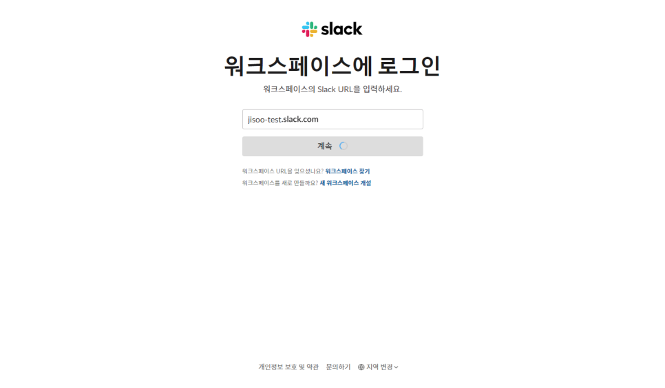
- AWS Chatbot 클라이언트가 구성되었습니다.
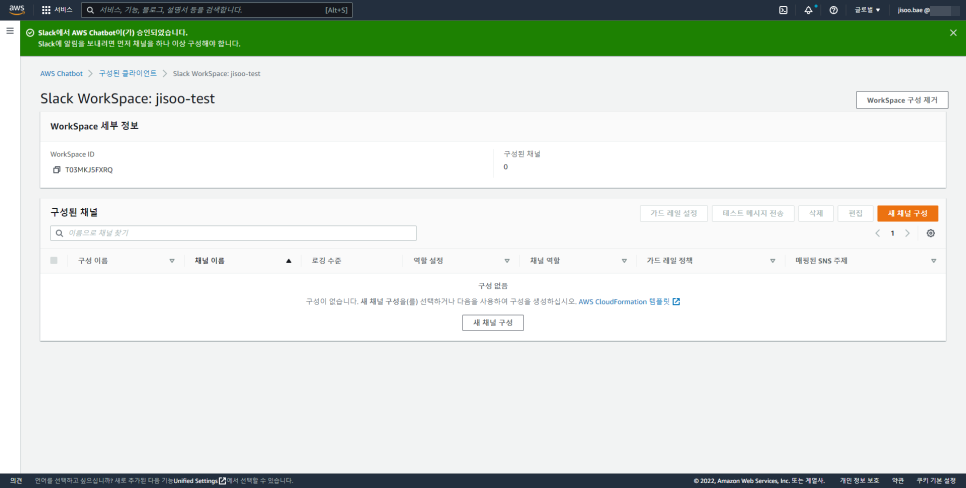
2) 채널 가드레일 정책 생성
- Slack 채널 구성을 위해 채널 가드레일 정책 설정이 필요합니다. Chatbot에 대한 모든 액세스(읽기, 쓰기)을 가지는 정책을 생성하여 연결합니다.

3) Slack 채널 구성
- 다음과 같이 Slack 채널 구성을 진행합니다.

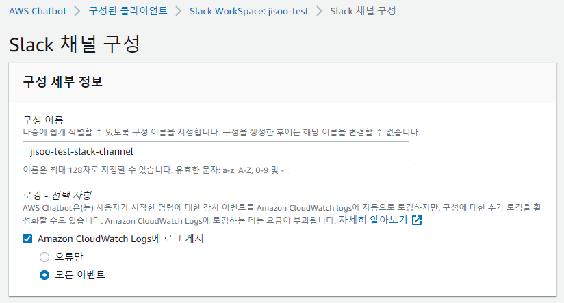
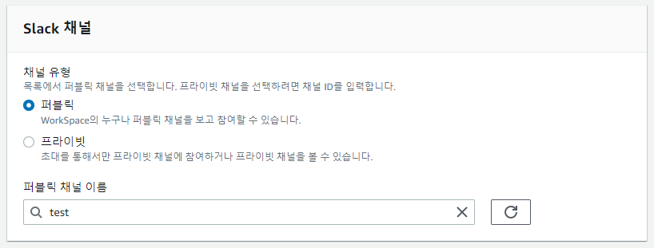
- 채널 IAM 역할에 위에서 생성한 역할을 등록하고 채널 가드 레일 정책에 위에서 생성한 정책을 등록합니다.
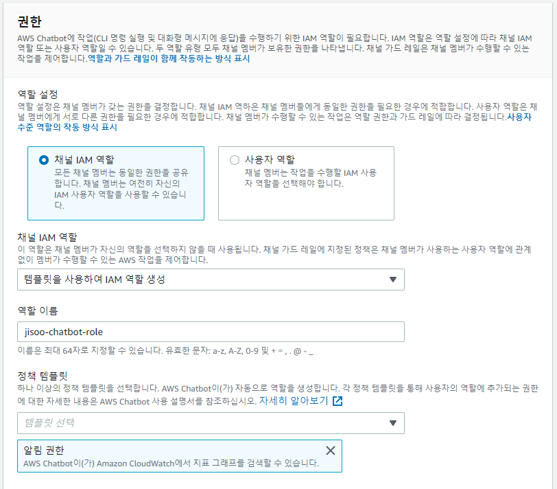

- 해당 Slack 채널에 알림을 전송하도록 앞에서 생성한 SNS 주제를 모두 추가합니다.

ㅇㅇ
---

##### "테스트 결과"
테스트 결과는 다음과 같습니다.
- 특정 인스턴스의 프로세스가 모두 다운되어 1분 동안 프로세스의 실행 수의 합계가 0인 경우 다음과 같이 CloudWatch 알람이 발생합니다.
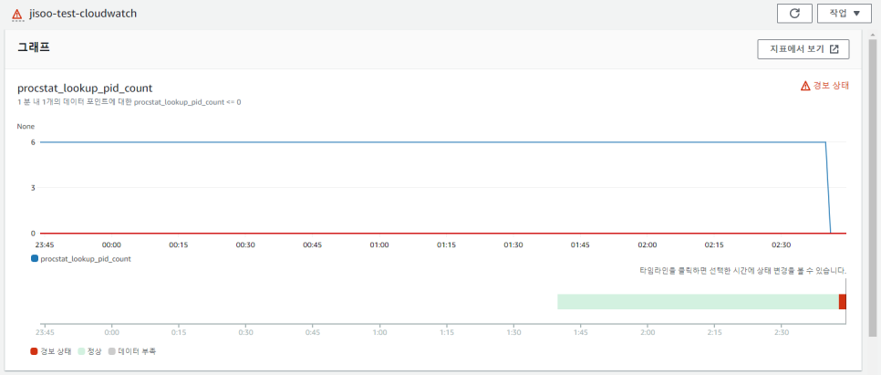

- 또한 SNS에 등록한 Slack 채널로 알람에 대한 메시지가 전송되며 CloudWatch 알람이 해제되어 상태가 정상으로 변경된 경우에도 다음과 같이 메시지가 전송됩니다.
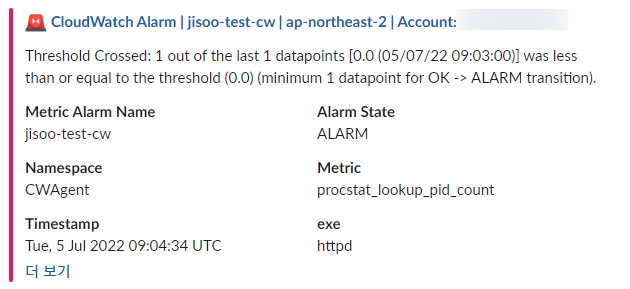
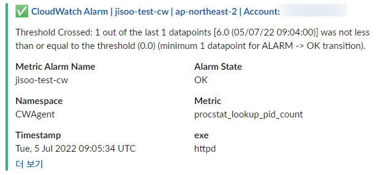

- Slack으로 전송된 메시지는 다양한 모바일 기기에서 확인할 수 있습니다.
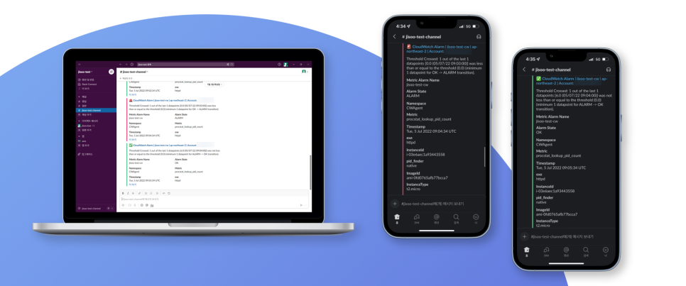
---
##### "마치며"

지금까지 작업한 내용을 정리해 봅시다!


1. Amazon EC2 인스턴스에 CloudWatch Agent와 SSM Agent를 설치합니다.
1. 통합 CloudWatch Agent에서 Procstat Plugin을  사용하여 프로세스 지표를 수집합니다.
1. CloudWatch 알람을 생성하여 특정 임계치에 도달한 경우 알람이 트리거되며 Amazon SNS를 연동하여 알림을 보냅니다.
1. Amazon SNS를 AWS Lambda로 연결하여 EC2 인스턴스 내에서 SSM Agent를 통해 Run Command를 수행하도록 합니다.
1. Amazon SNS를 AWS Chatbot과 연결하고 Slack과 연동하여 해당 알림에 대한 메시지를 수신하도록 합니다.

읽어주셔서 감사합니다.


---

🔗 참고 링크:  
[1] procstat 플러그인을 사용하여 프로세스 지표 수집 - [https://docs.aws.amazon.com/ko_kr/AmazonCloudWatch/latest/monitoring/CloudWatch-Agent-procstat-process-metrics.html](https://docs.aws.amazon.com/ko_kr/AmazonCloudWatch/latest/monitoring/CloudWatch-Agent-procstat-process-metrics.html)  
[2] Systems Manager 인스턴스에 프로파일 권한 추가 - [https://docs.aws.amazon.com/systems-manager/latest/userguide/setup-instance-profile.html#instance-profile-add-permissions](https://docs.aws.amazon.com/systems-manager/latest/userguide/setup-instance-profile.html#instance-profile-add-permissions)  
[3] CloudWatch Agent와 함께 사용하기 위한 IAM 역할 및 사용자 생성 - [https://docs.aws.amazon.com/ko_kr/AmazonCloudWatch/latest/monitoring/create-iam-roles-for-cloudwatch-agent-commandline.html](https://docs.aws.amazon.com/ko_kr/AmazonCloudWatch/latest/monitoring/create-iam-roles-for-cloudwatch-agent-commandline.html)  
[4] 마법사로 CloudWatch Agent 구성 파일 생성 - [https://docs.aws.amazon.com/ko_kr/AmazonCloudWatch/latest/monitoring/create-cloudwatch-agent-configuration-file-wizard.html](https://docs.aws.amazon.com/ko_kr/AmazonCloudWatch/latest/monitoring/create-cloudwatch-agent-configuration-file-wizard.html)  
[5] procstat 플러그 인을 사용하여 프로세스 지표 수집 - [https://docs.aws.amazon.com/ko_kr/AmazonCloudWatch/latest/monitoring/CloudWatch-Agent-procstat-process-metrics.html](https://docs.aws.amazon.com/ko_kr/AmazonCloudWatch/latest/monitoring/CloudWatch-Agent-procstat-process-metrics.html)  
[6] CloudWatch 콘솔에서 Lambda 함수 로그에 대한 "로그 그룹이 없음(Log group does not exist)" 오류를 해결하려면 어떻게 해야 합니까? - [https://aws.amazon.com/ko/premiumsupport/knowledge-center/lambda-cloudwatch-log-streams-error/](https://aws.amazon.com/ko/premiumsupport/knowledge-center/lambda-cloudwatch-log-streams-error/)  
[7] Tabifier - [https://tools.arantius.com/tabifier](https://tools.arantius.com/tabifier)  
[8] Boto3 Docs - [https://boto3.amazonaws.com/v1/documentation/api/latest/reference/services/ssm.html](https://boto3.amazonaws.com/v1/documentation/api/latest/reference/services/ssm.html)

📖 참고 도서:   
예제를 통해 쉽게 따라하는 아마존 웹 서비스(최준승, 이현진 지음)