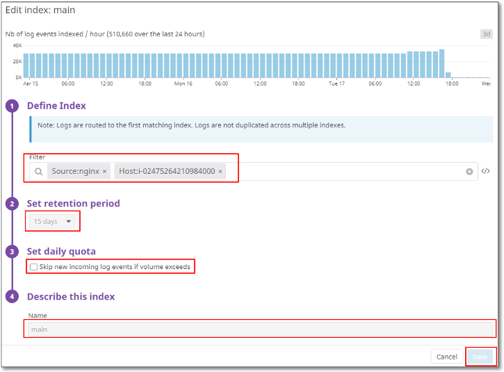
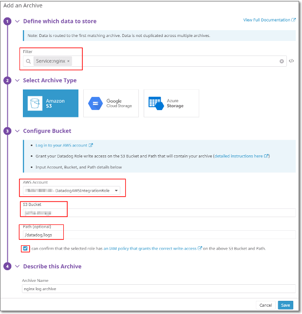
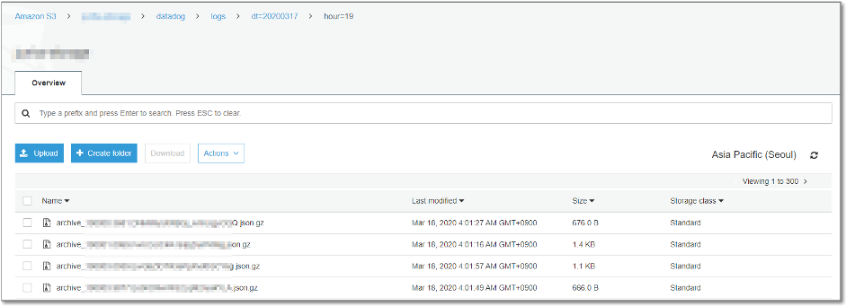

---
authors:
- junha hwang
date: "2020-12-10T19:12:00+09:00"
categories:
- Post
tags:
- Datadog
- Logs
title: Datadog에 Indexing 되는 로그에 대한 비용 최적화 하는 방법
---

## Log Management Indexing

Log Management에서 Log Event는 매 월 말에 인덱스 된 총 로그 이벤트 수를 계산하여 발생합니다. (온디멘드 Retention 15일 기준 100만개 당 $2.55요금 청구)
따라서 요금을 줄이기 위해서는 인덱스 되는 로그의 양을 줄이는 방법이 최선입니다. 
이를 위해 Retention 기간을 줄이는 방법과 Exclusion Filter를 이용하여 인덱스된 로그를 줄이는 방법이 있습니다. 
추가로 Retention기간을 줄이는 경우 저장된 로그의 장기 저장을 위하여 별도 저장소로 아카이빙 하는 방법이 있습니다.

## Log Management Index 비용
● Set retention period 기간별 가격 (한 달, 백만 로그 이벤트 기준) – 2020.03.18일 기준
Billed Annually 기준, on-demand는 ( )
- 3일: $1.06 (1.59)
- 7일: $1.27 (1.91)
- 15일: $1.70 (2.55)
- 30일: $2.50 (3.75)
- 45일: $3.30 (4.95)
- 60일: $4.10 (6.15)
  * Retention Period 변경은 Datadog Support에 변경 요청 진행해야 합니다.

## Log Management Indexing
1. Index Retention Period 줄이기 및 Daily quota 설정
    Logs > Configuration 에서 Indexes 탭으로 들어갑니다.

[그림 1] Indexes 탭

인덱스가 없는 경우 New Index를 클릭하여 인덱스를 생성하고 인덱스가 있으면 위 [그림 1]과 같이 Edit을 클릭하면 [그림 2]와 같은 Index 수정 창이 표시됩니다.

[그림 2] Index 수정

Define Index에서 Index를 처리할 로그에 대한 필터를 정의하고 Set retention period를 설정합니다.

(수정을 위해서는 Case Open 필요) 

여기서 Set daily quota를 설정할 경우 [그림 3]과 같이 하루에 Index되는 로그의 제한(Exclusion 처리 후의 로그 양)을 설정할 수 있습니다.

  * 설정 시 한도를 초과하는 로그는 Index 되지 않으니 주의

[그림 3] Set daily quota

모든 설정이 끝났다면 Save를 눌러주면 설정이 완료됩니다.

2. Exclusion Filter설정으로 Index 로그 줄이기
기존 Index에서 로깅이 필요하지 않은 로그(디버깅 로그 등)는 Exclusion Filter를 설정하여 Index되는 로그를 줄일 수 있습니다.

[그림 4] Add an Exclusion Filter

[그림 4]와 같이 설정한 Index 아래의 Add an Exclusion Filter를 클릭합니다.

Define exclusion query에서 제외할 로그의 쿼리를 설정 후 Set exclusion percentage에서 해당 쿼리에 걸리는 로그에서 제외할 비중(퍼센트)을 설정하고 저장합니다.

[그림 5] Exclusion Filter 설정 창

3. Index된 로그를 별도 저장소로 아카이브
비용 절약을 위해 Retention Period가 짧게 설정된 상태이므로 Log의 장기 저장을 위해 별도의 스토리지에 아카이브를 수행합니다.
  * 여기서는 AWS S3로 설정 하였습니다.

Logs > Configuration 에서 Archives 탭으로 들어갑니다.

[그림 6] Archive 생성

[그림 6]와 같이 New archives를 클릭하면 아카이브 생성 창이 표시됩니다.

Archive 설정을 진행 합니다.
      
    1) Define which data to store에서 아카이브를 진행할 Log를 Filter 설정합니다.
    2) Archive Type은 S3를 선택합니다.
    3) Configure Bucket에서 AWS Account는 기존 AWS Integration시 사용한 Role을 선택합니다.
    4) Log가 저장될 S3 Bucket과 Path를 설정합니다.
    5) Archive Name을 설정 후 Save합니다.

[그림 7] Archive 설정

앞서 Archive 할 스토리지를 확인해보면 아래와 같이 정상적으로 Archive 된 로그를 확인 할 수 있습니다.
[그림 8] Archive 된 로그들

