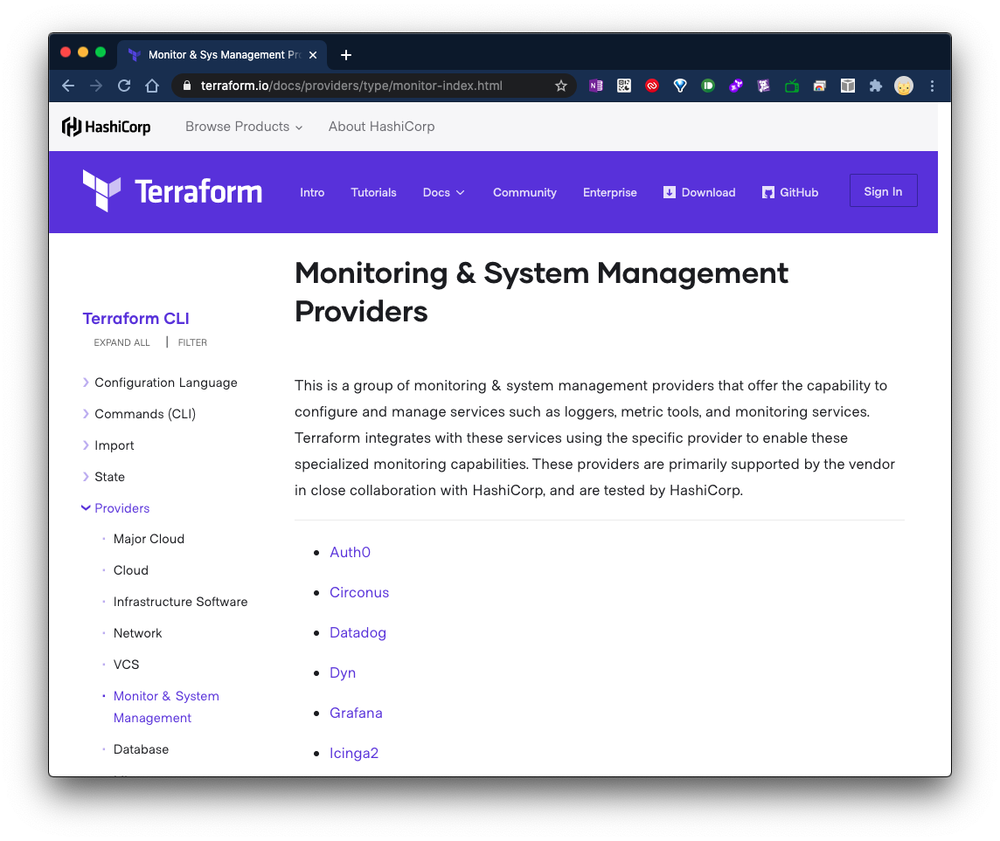
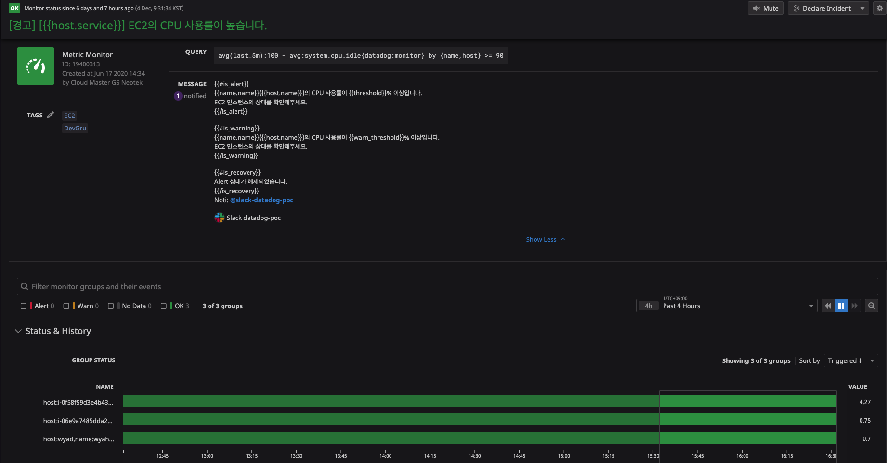

여러 클라우드 환경에서 이곳저곳 산재되어 있는 클라우드 리소스들을 통합적으로 모니터링이 가능하게 해주는 모니터링 솔루션인 Datadog을 알아 보자.

Datadog은 Monitor 기능을 통해 리소스들에 문제가 발생 시 알람을 받을 수 있도록 하는 기능을 제공 한다.

여러 서비스를 신규 런칭을 위해 이러한 알람을 새롭게 생성할 때 마다 Datadog Console에서 마우스로 직접 할 때의 과정은 여간 귀찮은게 아니다. -_-;  

여러 서비스에 대해 알람을 설정할 때마다 마우스로 직접하려고 하니 미쳐 날 뛸 뻔한 경험을 겪어왔다.
이러한 흔히 말하는 노가다성 작업을 할 때 마다 시간을 줄일 수 있는 방법이 있나 여러 고민을 하게 됬다.

고민 하던 와중에, Terraform으로 가능하지 않을까? 생각하게 되었고 Terraform 홈페이지에 들어가 제공되는 provider 목록을 살펴 보았다.

짜잔! Datadog이 있.었.다.!!




## 1. Terraform 설치
Terraform을 사용하기 위해서는 실행할 컴퓨터에 Terraform을 설치해야 한다.

Terraform 설치는 공식 문서를 참고하여 설치 한다.

[Install Terraform](https://learn.hashicorp.com/tutorials/terraform/install-cli?in=terraform/aws-get-started)


## 2. Terraform 코드 작성

자, 이제 알람을 생성 해보자.


VM의 CPU 사용율에 대해 모니터링하기 위한 알람을 생성 해보자.

먼저, Terraform 코드를 작성 한다.

#### 1)provider를 정의하기 위한 datadog.tf 파일을 생성 후, 아래와 같이 작성한다.

datadog.tf
```tf
provider "datadog" {
  api_key = "${var.datadog_api_key}"
  app_key = "${var.datadog_app_key}"
} 
```

변수를 지정하는 var.tf 파일을 생성 후, 아래와 같이 작성한다.

var.tf 
```tf
variable "datadog_api_key" {}
variable "datadog_app_key" {}
```

#### 2) Datadog에 데이터를 전달하려면 API Key/ Application key가 필요하다.
해당 Key를 확인하는 방법은 아래와 같다.

1. Datadog Console에 로그인
2. Integrations > APIs 

API Key는 기본적으로 활성화 되어 있다.
Application Key는 Create 선택하여 생성 해준다.
Note. 여러개의 Key를 생성할 경우가 있는데, 이때 해당 키들의 구분을 위한 이름을 지정할 수 있다. Application Key 이름은 생성후, 수정할 수 없으니 신중하게 설정하는 것을 권장한다.


API Key를 정의하기 위한 secret_key.tfvars 파일을 생성 후, 아래와 같이 작성한다.

Note. "" 영역안에 자신의 각 Key를 입력한다.

secret_key.tfvars
```tf
datadog_api_key = "<API Key를 입력하세요>"
datadog_app_key = "<APP Key를 입력하세요>"
```

자, 본격적으로 VM의 CPU 사용율 알람을 위한 모니터를 작성 해보자.

모니터를 정의하기 위한 monitor-ec2.tf 파일을 생성 후, 아래와 같이 작성한다.

Note. tf 파일 이름은 정의된 이름은 없으며, 구분하기 쉽게 작성하는 것을 권장 한다.

VM의 CPU 사용율 알람을 위해 작성된 완성 코드는 아래와 같다. 

monitor-ec2.tf 
```tf
resource "datadog_monitor" "ec2_cpu" {
name = "[경고] [{{host.service}}] EC2의 CPU 사용률이 높습니다."
type = "query alert"
query = "avg(last_5m):100 - avg:system.cpu.idle{monitor:datadog} by {name,host} >= 90"
message = <<EOF
{{#is_alert}}  
{{name.name}}({{host.name}})의 CPU 사용률이 {{threshold}}% 이상입니다.  
EC2 인스턴스의 상태를 확인해주세요.  
{{/is_alert}}  

{{#is_warning}}  
{{name.name}}({{host.name}})의 CPU 사용률이 {{warn_threshold}}% 이상입니다.  
EC2 인스턴스의 상태를 확인해주세요.  
{{/is_warning}}  

{{#is_recovery}}  
Alert 상태가 해제되었습니다.  
{{/is_recovery}}  
Noti: @slack-datadog-poc @noc@gscdn.com
EOF
tags = ["EC2"]
notify_audit = false
locked = false
timeout_h = 0
include_tags = true
require_full_window = false
new_host_delay = 300
notify_no_data = false
renotify_interval = 0
escalation_message = ""
thresholds = {
critical = 90
warning = 80
}
}
```

뭔가, 장황하게 길다 -_-
겁을 내지마시오..!

몇번 작성해보면 이해하기 쉬운 코드 이다.
Terraform은 HCL(HashiCorp Configuration Language)라는 코드 문법을 사용 한다.
Datadog에 아직 익숙하지 않다면, 먼저 Console에서 직접 모니터들을 만들어 보고 Terraform을 이용하여 모니터를 생성하는 것을 권장한다.
그 이유는 위에 코드를 보면 알겠지만, 각 옵션들의 기능들을 이해해야 하는데, 직접 모니터를 만들면 해당 옵션 값에 대해 이해 하기가 쉽다.

```
resource "datadog_monitor" "ec2_cpu" {
```
resource는 예약어 이다. 

"datadog_monitor"는 프로바이더가 정의한 리소스 종류를 말한다.
여기서 Datadog의 알람 기능인 Monitor를 생성하는 것이기에 `datadog_monitor` 이다.

terraform은 tfstate 라는 이름으로 상태를 저장한다. "ec2_cpu" 라는 유니크한 리소스 이름으로 저장하여 테라폼 내부에서 참조하기 위해 사용 된다.

{} 이하부터는 속성 명:속성 값으로 이루어진다.

```
name = "[경고] [{{host.service}}] EC2의 CPU 사용률이 높습니다."
type = "query alert"
query = "avg(last_5m):100 - avg:system.cpu.idle{datadog:monitor} by {name,host} >= 90"
```

`name` 은 모니터의 제목이다.
type 은 모니터(알람)의 유형으로서 많이 쓰이는 종류는 임계치 기반의 알람인 `query alert` 이다.

그밖에 종류는 다음과 같으며, 자세한 내용은 첨부된 Datadog 문서를 참고

Alert 종류 [Link:] https://docs.datadoghq.com/monitors/monitor_types/

`query` 는 모니터(알람)을 평가할 매트릭(Metric=지표)을 말한다.

작성된 쿼리를 풀어 말하자면, manged:datadog 태그를 가진 인스턴스들 중 cpu idle 값에 100을 뺀 값에 대해 마지막 5분 평균 값이 90과 같거나 클 경우 알람이 울리게 하라는 쿼리이다.

#### 메시지 정의

```
message = <<EOF
{{#is_alert}}  
{{name.name}}({{host.name}})의 CPU 사용률이 {{threshold}}% 이상입니다.  
EC2 인스턴스의 상태를 확인해주세요.  
{{/is_alert}}  

{{#is_warning}}  
{{name.name}}({{host.name}})의 CPU 사용률이 {{warn_threshold}}% 이상입니다.  
EC2 인스턴스의 상태를 확인해주세요.  
{{/is_warning}}  

{{#is_recovery}}  
Alert 상태가 해제되었습니다.  
{{/is_recovery}}  
Noti: @slack-datadog-poc
EOF
```


`message`는 알람 받을 메시지에 대한 내용이다.

`<<EOF EOF`는 메시지 시작과 끝을 정의 한다.

`{{#is_alert}}{{/is_alert}}`는 threshold(임계치) 설정 중 Alert 상태가 발생 하였을 때 받을 메시지를 정의한 내용이다.

{{}} 로 정의하는 부분은 Terraform 문법이 아닌, Datadog 메시지를 정의할 때 사용하는 내용이다. 
Datadog의 Monitor에서 메시지를 작성할 때 마크다운(Markdown) 문법도 사용할 수 있다. 

`{{#is_warning}}{{/is_warning}}`는 threshold(임계치) 설정 중 warning 상태가 발생 하였을 때 받을 메시지를 정의한 내용이다.

`{{#is_recovery}}{{/is_recovery}}`는 정의된 threshold(임계치) 밑으로 도달할 때 회복됬다는 메시지를 전달 받을 내용이다.

마지막으로 @를 이용하여 슬랙이나, e-mail로 해당 메시지를 전달 받을 수 있다.

@slack 했을 때 나오지 않을 경우, 먼저, Slack Integration을 진행 하자.

#### Monitor(알람)의 설정 옵션 

```
tags = ["EC2"]
include_tags = true
notify_audit = false
locked = false
timeout_h = 0
require_full_window = false
new_host_delay = 300
notify_no_data = false
renotify_interval = 0
escalation_message = ""
thresholds = {
critical = 90
warning = 80
}
}
```
`tags = ["EC2"]` 는 운영을 하다보면 알람을 받을 각종 Monitor가 생성이 된다. 해당 Monitor들을 쉽게 필터할 때 사용하는 태그 이다.
태그를 이용할 것을 권장 한다.
include_tags = true

```
thresholds = {
critical = 90
warning = 80
}
```
위에서 언급한 thresholds(임계치) 값 정의하는 부분 이다.


## Terraform Workflow

Write > Plan > Create

- Write
각 생성할 리소스를 코드로 정의 한다.
코드 작성 완료후 terraform init을 통해 Provider의 플러그인을 설치 한다.

> terraform init


- Plan
> terraform plan

Terraform으로 생성할 리소스를 정의한 내용에 대해 확인하는 단계이다.
실제 Provider에 리소스가 배포 되기 전에, 또는 변경할 부분에 대해 tfstate=상태 와 비교하여 변경될 부분을 확인 해준다.


- Create(Apply)

>terraform apply

Provider에 리소스가 실제로 배포되는 단계이다. 


Datadog Console에서 좌측의 Managed Monitor 를 선택 후, 생성된 모니터를 확인 해보자.

아래 화면과 같이 생성된 모니터를 확인 할 수 있다.



야!너두 할수 있.다.!

good luck:)


