## Azure Active Directory와 G Suite 연동하기  
Azure AD 에서 사용자를 관리하고 있지만, G Suite를 사용해야 하는 경우가 발생할 수 있습니다.
이 상태에서 사용자의 생성 및 삭제와 관련된 모든 작업은 Azure AD에서만 진행 하고, G Suite에서는 메일 및 메신저와 같은 기능을 사용할 때, 관리자는 어떤 작업이 필요하게 될 지 고민하게 됩니다.

이런 상황에서 관리자는 고민을 하게 됩니다.

하나의 관리 지점에서 어떻게 하면 Azure Active Directory와 G Suite를 사용할 수 있을까?

위 질문은 Azure Active Directory와 G Suite 간의 SSO (Single Sign-On) 기능 구현으로 도달하게 됩니다.

Microsoft 에서는 이를 해결하기 위해 앱을 통하여 Azure Active Directory에서 사용자를 관리하고, G Suite을 사용하게 가능한 Google Cloud (G Suite) Connector를 Enterprise Application에 추가하게 됩니다.

이 기능을 통해 다음과 같은 환경 구성이 가능하게 됩니다.

	•	 Azure Active Directory에서는 관리자가 사용자의 생성 및 삭제와 관련된 작업을 진행하게 됩니다.
	•	 생성된 사용자는 Provisioning 기능을 통해, G Suite 으로 계정이 생성 및 동기화가 됩니다.

현재 상태는 다음과 같습니다.

	•	 G Suite에서는 Cloudmt.fun 이라는 도메인을 사용하여 메일 송수신이 가능한 상태
	•	 Azure Active Directory에서는 사용자 지정 도메인으로 Cloudmt.fun 도메인을 사용하고 있는 상태
	•	 Azure Active Directory와 G Suite 간의 동일한 UPN을 가진 사용자는 존재하지 않음

위와 같은 구성을 위해서는 다음과 같은 작업이 필요합니다.

Microsoft Azure에서 Azure Active Directory의 Enterprise Application으로 이동합니다.
이동을 한 후엔, 추가 버튼을 클릭하여 Google Cloud / G Suite Connector by Microsoft를 클릭하여 Azure Active Directory에 앱을 추가합니다.
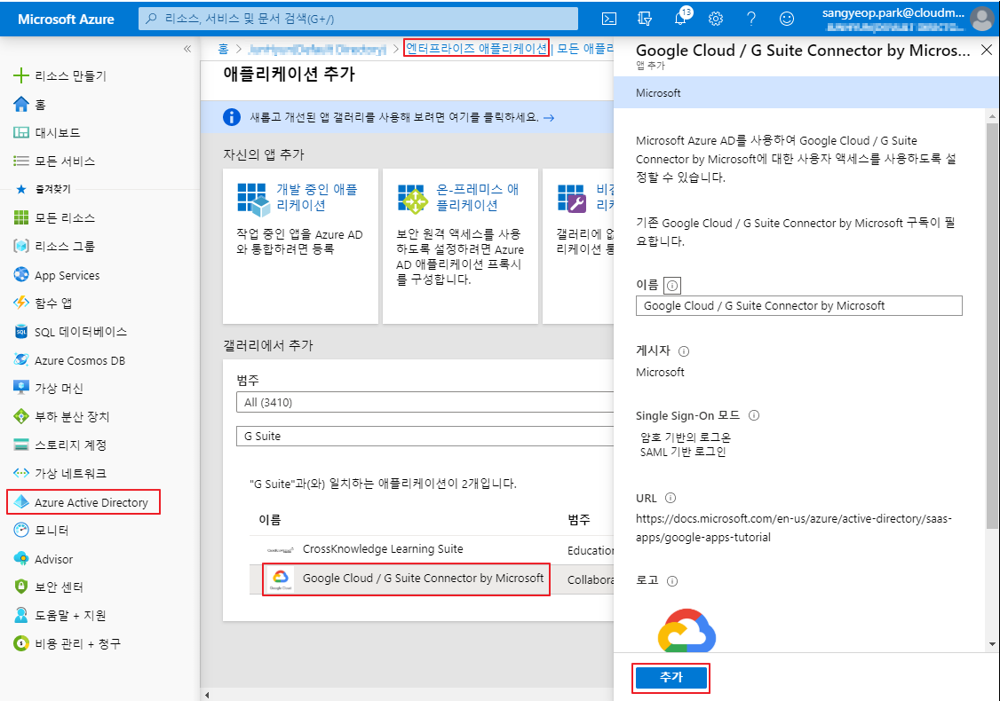

잠깐의 시간이 흐른 뒤 앱은 정상적으로 등록이 되며, 
Enterprise Application의 앱에서 추가된 Google Cloud / G Suite Connector by Microsoft 앱을 클릭하면 다음과 같은 화면을 볼 수 있습니다.
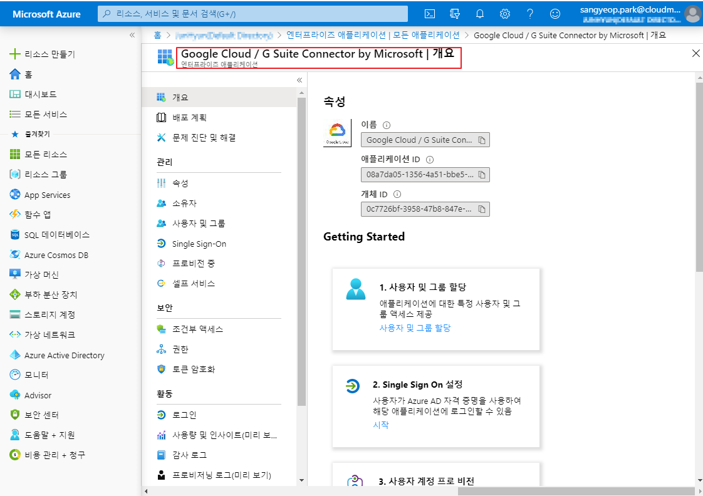

Google Cloud / G Suite Connector by Microsoft 개요 탭에서 Getting Started를 보시면, 앱을 추가 한 다음 진행해야 할 작업이 나열되어 있습니다. 최초에 진행 할 작업은 사용자 및 그룹 할당입니다.
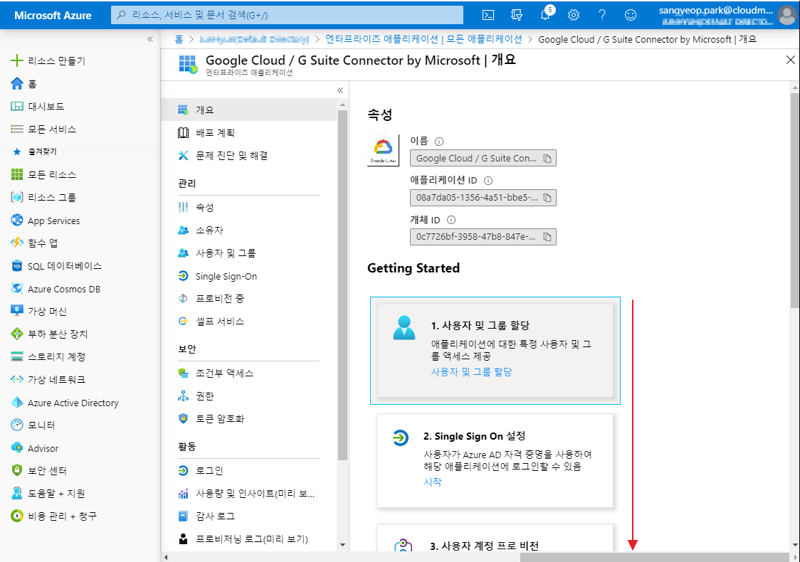

사용자 및 그룹 추가 메뉴를 선택하여 이 앱을 사용할 사용자를 선택합니다.
화면에서는 사용자만을 추가하기 위해서 사용자 추가 화면으로 진행하였습니다.
사용자 추가를 클릭하여, 기존에 Azure Active Directory에 존재하는 사용자를 추가합니다.
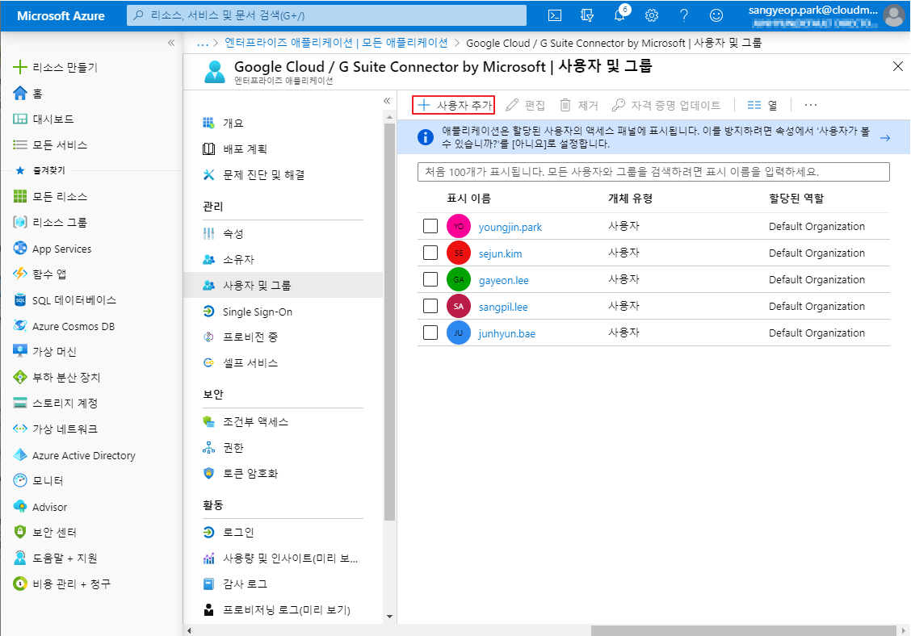

다음은 Single Sign-on 설정입니다. Single Sign-on 설정을 통해 Azure Active Directory의 사용자를 G Suite으로 동기화 합니다. 선택 후 SAML을 선택합니다.
SAML이란? 인증 정보 제공자(identity provider)와 서비스 제공자(service provider) 간의 인증 및 인가 데이터를 교환하기 위한 XML 기반의 개방형 표준 데이터 포맷을 의미합니다.

SSO 방식을 SAML 방식으로 변경하면 다음과 같은 화면이 진행되며, SAML 기반 로그인에 대한 설정을 진행합니다. 
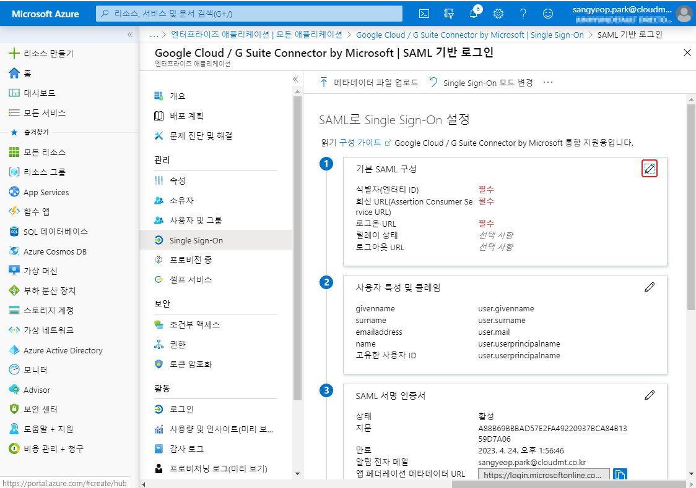

기본 SAML 구성에서 우측에 연필 모양 아이콘을 클릭하여 값을 수정합니다.
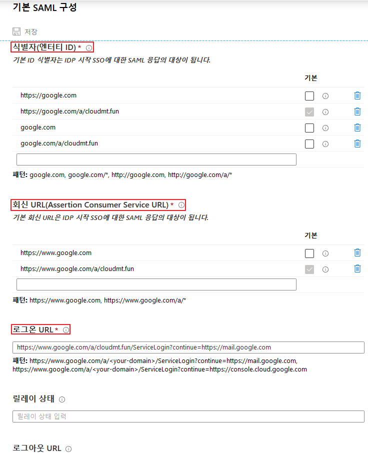

•	식별자(엔터티 ID)
  입력 방식은 위와 같이 https://google.com/a/mydomadin 형식으로 변경하여 입력합니다.
  사진에서는 사용 중인 도메인이 cloudmt.fun이기 때문에 https://google.com/a/cloudmt.fun 으로 입력하였습니다.

•	회신 URL (Assertion Consumer Service URL) 또한 위와 마찬가지로 도메인을 변경하여 입력합니다.

•	로그온 URL을 두어 정상적으로 로그온 할 수 있는 주소를 입력합니다. 이 로그온 URL 또한 중간에 도메인을 변경하여 입력합니다.

이제 두 번째로 사용자 특성 및 클레임을 입력합니다.
  
(위 설정은 앱을 추가하면 기본으로 설정되는 사용자 특성 및 클레임입니다.)
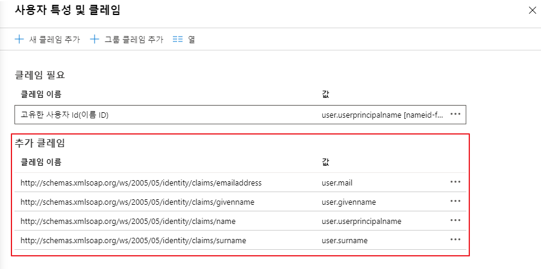  
사용자를 매핑하는 기준은 사용자의 UPN을 기준으로 이루어지기 때문에, 다른 클레임은 필요하지 않습니다.
추가 클레임을 전부 삭제 한 후에 고유 클레임을 남겨둡니다.
(고유 클레임은 삭제할 수 없습니다.)

3번 단계인 SAML 서명 인증서는 차후에, G Suite에서 설정이 필요하기 때문에, 우선은 파일을 받아둡니다. (Base64로 인증서를 다운로드 합니다.)  
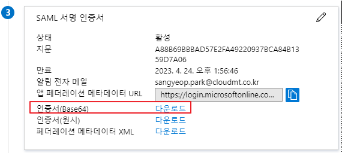  
(인증서는 정해진 기간이 있기 때문에, 알림 전자 메일을 통해 해당 인증서가 만료되기 전에 교체하는 작업이 필요합니다. 인증서가 만료되면 SSO는 동작하지 않습니다.)

4번 단계의 정보를 G Suite에 입력하기 위해 다음의 정보를 복사합니다.
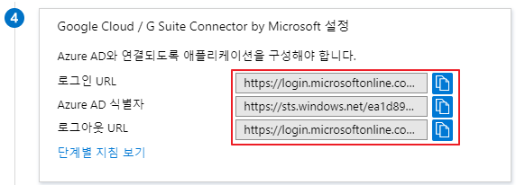  

위 정보를 복사 한 후에 G Suite (admin.google.com) 으로 이동한 다음, 관리 콘솔의 보안 > 설정으로 이동하여 '타사 ldP를 사용해 싱글 사인온(SSO) 설정'으로 이동합니다.
  
(타사 ID 제공업체에 SSO 설정 체크 후
로그인 페이지 URL, 로그아웃 페이지 URL을 Azure Portal에서 확인된 4번의 항목에서 복사 후 붙여넣기를 합니다. 마지막으로 도메인별 발행자 사용을 체크 한 후 해당 내역을 저장합니다.)

위 작업까지 완료되었을 경우, 다시 Azure Portal로 돌아옵니다.
돌아온 후에, 프로비전 중 메뉴로 처음 들어가게 되면, 아래와 같이 프로비전 모드를 자동으로 바꿔줍니다.
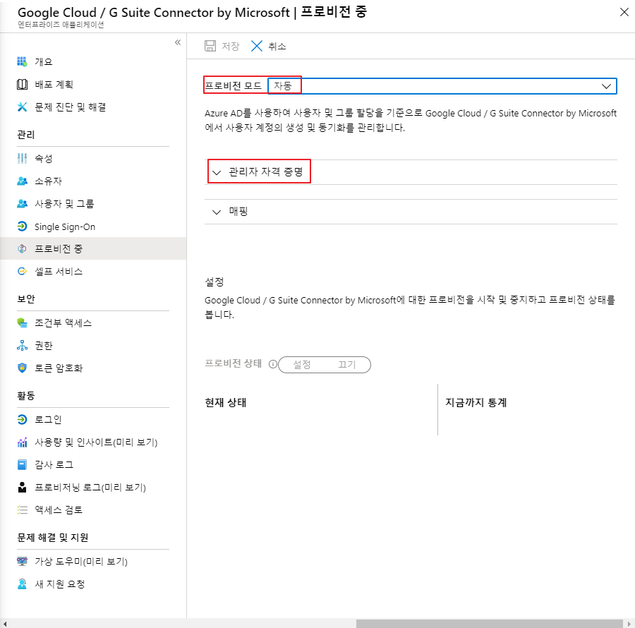  

관리자 자격 증명을 입력 할 경우 Google 관리 센터에 접근하는 계정을 입력합니다.
해당 계정은 Google에서 최고 관리자 권한을 가지고 있는 계정으로 접근합니다.  
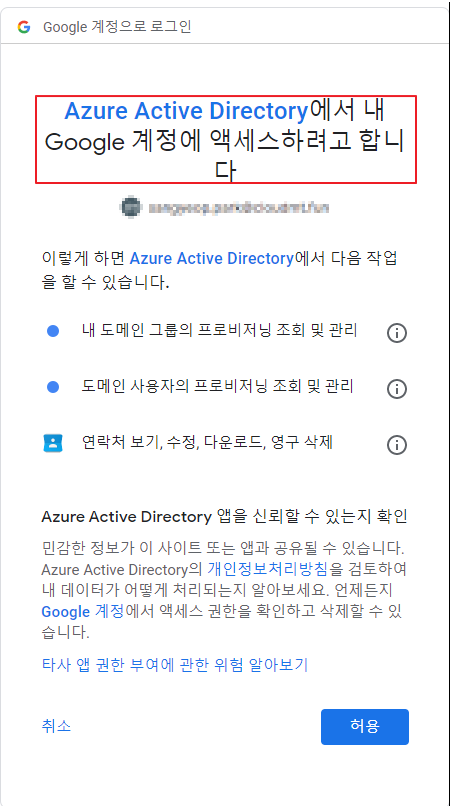  

현 단계에서 연결 테스트를 거치지 않고 프로비전이 실패할 경우를 대비하여, 알림 전자 메일 및 오류 발생 시 전자 메일 보내기를 선택합니다.  
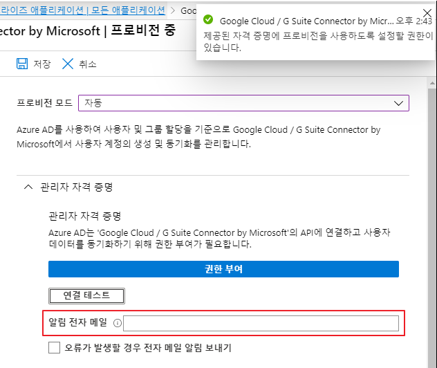

매핑 부분에서는 어떠한 값이 매핑 되는지를 확인할 수 있습니다. (사용자 및 그룹)
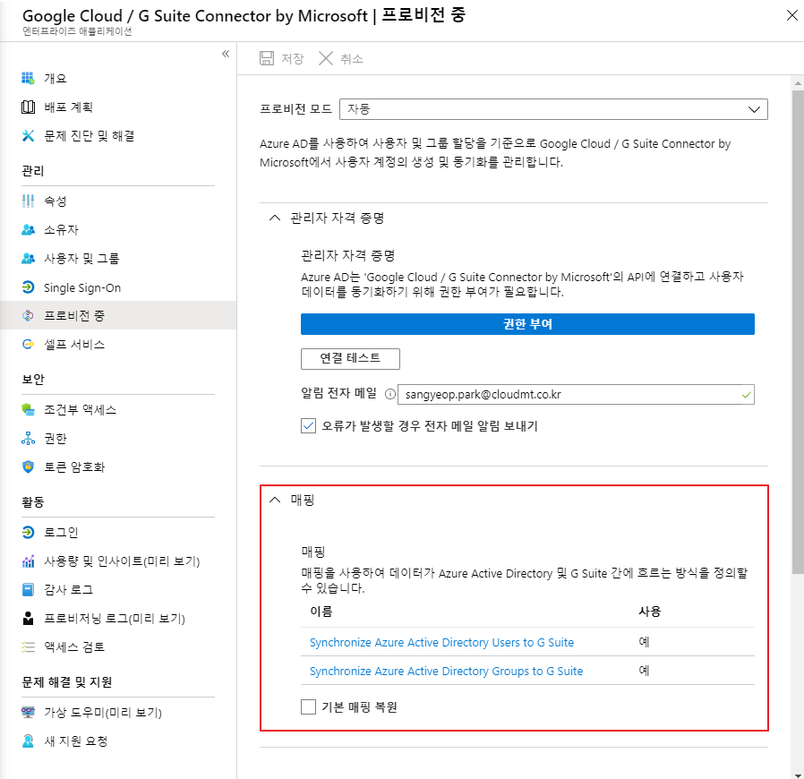  
(하기 화면은 사용자 특성 매핑 화면입니다.)
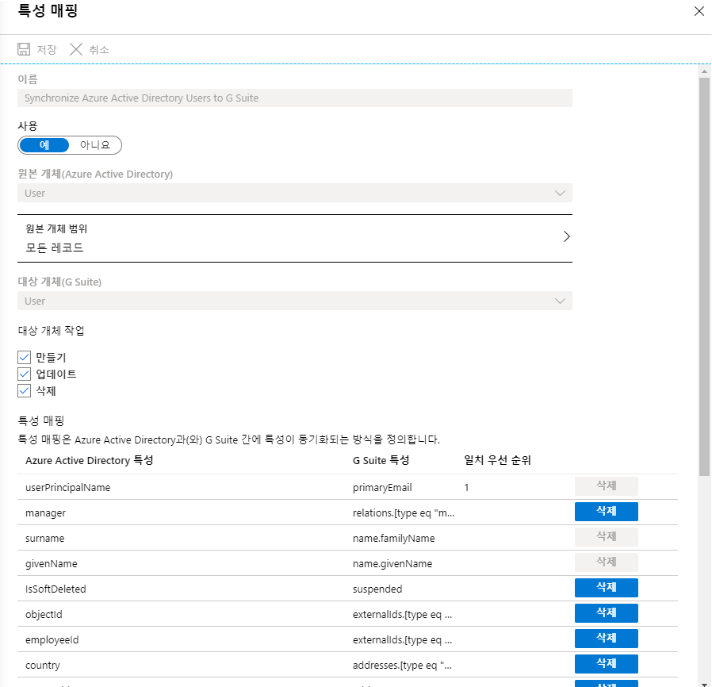  

이제 하단의 프로비전 상태를 설정으로 표시하고 저장을 다시 저장을 클릭합니다.
(프로비저닝은 40분을 기준으로 자동으로 진행되며 프로비저닝 주기를 임의로 변경할 수는 없지만, 바로 실행은 가능합니다.)
> 설정 전

> 설정 후

위 단원까지 완료하였을 경우, 정상적으로 Azure Active Directory에서 G Suite으로 계정이 프로비전 됩니다.

	•	 사용자가 생성될 경우 동일한 이름의 사용자가 G Suite에 있어선 안됩니다.
	•	 G Suite에서 사용자 계정이 자동으로 정지됨 일 경우 사용자가 로그인하여 해당 문제를 해결할 수 있습니다.
	•	 프로비저닝 실패에 대한 로그는 프로비저닝 감사 로그를 통해 확인할 수 있습니다.
  
