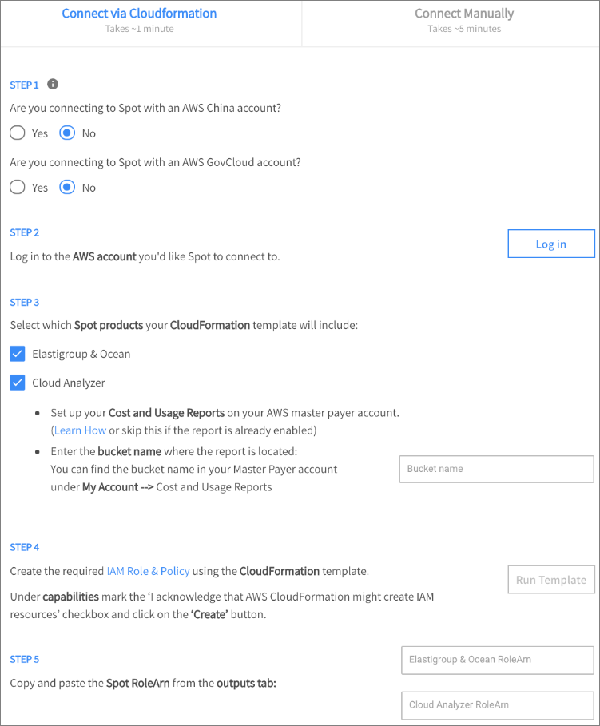
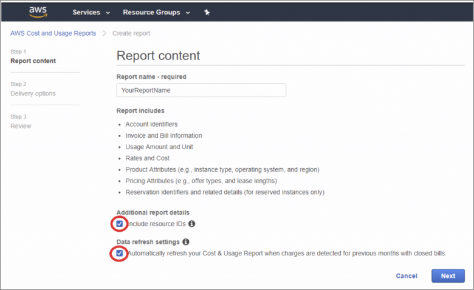
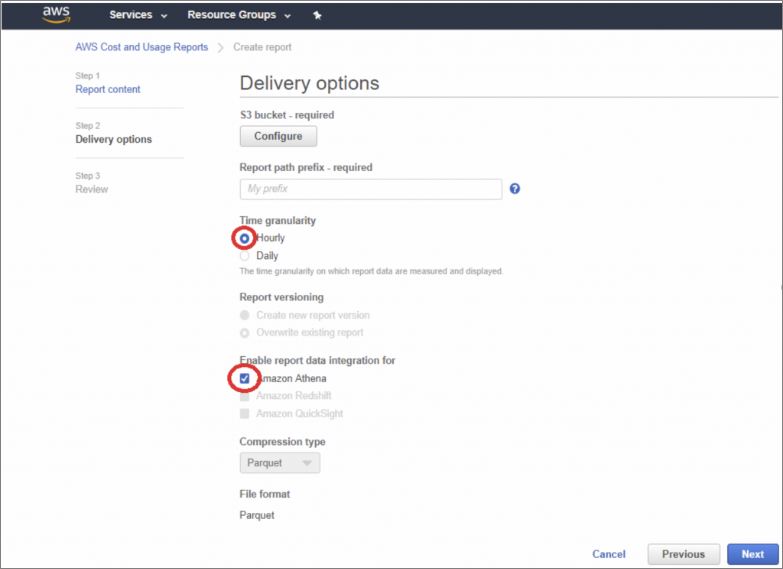
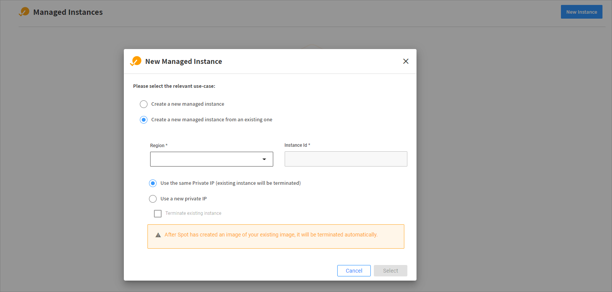

---
authors:
- Yerim kim
date: "2021-02-17T00:00:00Z"
categories:
- Cloud
tags:
- Spot
- Netapp
- AWS
- Budget
title: Spot By NetApp 시작하기
feature_image: "images/aws.png"
---

Spot by NetApp은 3사 클라우드의 Spot Instance를 더욱 비용 효율적으로 사용하고, 비점유형 인스턴스 사용 시 발생할 수 있는 서비스 다운타임을 최소화하기 위한 기능을 제공합니다. 

> ***spot Instance란?*** 스팟 인스턴스(spot Instance)는 온디맨드 가격보다 저렴한 비용으로 사용할 수 있는 미사용 컴퓨팅 인스턴스입니다. AWS와 Azure는 Spot Instance, GCP는 Preemptible VM 으로 제공됩니다. 매우 저렴한 대신 항상 이용 가능한 자원은 아니며, 각 클라우드 업체마다 제한 사항이 존재합니다. 따라서 단기간 작업을 요구하는 배치(Batch)성 작업이나 갑작스러운 중단에 영향을 받지 않는 작업에 이용하는 것을 권장합니다. 
 
우선, Spot by NetApp에 계정을 연결하는 방법을 알아보도록 하겠습니다. Free Plan에서는 20개 노드까지 제공하므로 Spot by NetApp의 기능을 직접 확인하실 수 있습니다. 

 ## 1. Spot by NetApp 가입

(1) [Spot 콘솔](https://console.spotinst.com/)로 접속하여 **Sign UP**을 클릭합니다.

(2) 정보를 입력한 후, 메일로 확인 절차를 거치면 가입이 완료됩니다. 

 

(3) AWS, Azure, GCP와 연동할 수 있습니다.

 
 

 ## 2. AWS 계정 연결

우선 기능이 가장 많은 AWS 계정을 연결하겠습니다. 연결 방법에는 Cloudformation을 이용하는 방법과 수동으로 연결하는 방법이 있습니다. 이번 포스팅에서는 Cloudformation을 이용한 연결 방법을 소개하겠습니다. 

> 조직을 등록하려면 조직 관리자 권한이 필요합니다. 또한, Cloud Analyzer를 사용하여 Spot 비용을 분석하려면 AWS Master Payer 계정의 Cost and Usage Reports에 대한 read-only 권한이 필요합니다. 

(1) Step 1의 문항에 No를 클릭합니다. 

(2) 조직 관리자 권한이 있는 AWS 계정으로 로그인하여 연결합니다.

(3) 연결할 기능을 선택합니다. Elastigroup, Ocean, Cloud Analyzer를 모두 선택하면, 해당 기능을 모두 포함하는 CloudFormation이 생성됩니다. 

(4) AWS Cost and Usage Reports를 매시간 생성하도록 설정하고, S3버킷에 저장합니다. 

(5) Step3에 Reports가 저장되는 S3의 이름을 입력합니다. 

(6) 템플릿을 사용하여 IAM Role & Policy를 생성합니다. 

(7) 실행 후, outputs 탭의 Spot RoleArn을 Step5 빈칸에 입력합니다. 

 ## 3. 콘솔 확인

AWS를 연결한 콘솔 화면입니다. Cloud Analyzer 연동 시, 초기 데이터 동기화에 최대 48시간 소요될 수 있습니다. 

가장 눈에 띄는 것은 잠재비용(Potential Costs)과 실제 비용(Actual Spot Costs)입니다. 1,101 시간 Spot by NetApp으로 인스턴스 3개를 가동한 결과, 82%까지 비용을 절감한 것을 확인할 수 있습니다. 

아쉽게도 무료 체험 버전에서는 단일 조직만 관리할 수 있습니다. AWS, Azure, GCP를 모두 확인해보고 싶으시다면, 여러 계정을 사용하여 조직을 생성한 뒤 사용자를 초대하는 방법을 이용하셔야 합니다. 초대받은 조직은 오른쪽 상단 조직 변경 메뉴를 통해 확인하실 수 있습니다. 

Spot by NetApp에서 제공하는 기능 중 가장 기본적인 기능부터 소개하겠습니다. 

### (1) CLOUD ANALYZER

Cloud analyzer는 클라우드 리소스 관리 및 비용 최적화 현황을 확인할 수 있는 대시보드입니다. 클라우드 비용을 모니터링 및 추적할 수 있으며, 낭비되는 자원을 파악하여 추가로 절약할 수 있는 비용을 보여줍니다. 
제공하는 기능은 크게 3가지입니다. 

- **Cost Analysis** : 과거, 현재, 그리고 앞으로 발생할 비용에 대한 세부 사항을 확인할 수 있습니다. 조직의 전체 클라우드 비용은 물론, 개별 워크로드, 계정, 그리고 서비스별 비용도 확인할 수 있습니다. 

- **Trends & Notifications** : 클라우드 사용량에 대한 추이를 분석하고 이상 지표를 탐지합니다. 서비스 사용량 급증, 인스턴스 장애 등 다양한 이벤트를 표시해줍니다. 사용자 지정 파라미터를 구성하여 그 외 지표도 확인할 수 있습니다. 

- **Optimization** : Spot 플랫폼의 다른 도구로 가는 중간 문 역할을 합니다. 대시보드는 전체 계정에서 절약한 비용을 요약하여 제공하고, Spot 최적화 솔루션을 사용하여 최적화할 수 있는 워크로드를 식별하며, 버튼 클릭 한 번으로 구현 및 자동화할 수 있는 자세한 권장 사항을 제공합니다.

### (2) MANAGED INSTANCE

managed instance는 Spot by NetApp 콘솔에서 생성하거나, 기존 인스턴스를 등록하여 사용할 수 있습니다. 

> **참고 :** Elastic IP는 콘솔에서 생성할 수 없어서 AWS 콘솔에서 미리 생성한 것을 인스턴스에 연결하여 사용해야 합니다. 또한, Spot에서 기본 제공하는 이미지로 생성하는 것보다 AWS에서 제공하는 이미지의 ID를 복사하여 생성하는 것을 권장합니다. 

Managed Instance로 관리되는 Spot들은 가용 스팟이 부족하여 삭제될 시, AMI(Amazon Machine Image)를 생성합니다. 이를 이용하여 새로운 Spot 인스턴스를 띄우고, 설정에 따라 기존 Root Volume이나 Data Volume을 그대로 사용할 수 있습니다. 

EC2 인스턴스를 교체해야 하는 경우 기존 관리 인스턴스는 일시 정지 상태가 됩니다. 이때 Root 볼륨에 대한 Snapshop을 만들고, 이를 통해 AMI를 생성하여 다음 인스턴스 시작 시 사용합니다. 재개(Resume) 과정을 거쳐 새로운 인스턴스가 시작되고 이용 가능한 상태가 되면 Active로 변합니다. 해당 과정은 각 인스턴스의 Instance Activity에서 확인할 수 있습니다.

[Spot 콘솔](https://console.spotinst.com/)에 접속하셔서 앞선 내용을 직접 확인해 보실 수 있습니다. Free Plan에서는 최대 20개 노드를 무료로 사용할 수 있고, 메트릭은 30일 동안 저장됩니다. 

