---
authors:
- youngbin han
date: "2020-11-15T00:00:00Z"
categories:
- Tech
tags:
- Azure
- Microsoft Azure
- Azure DevOps
- App Service
title: ASP.NET앱 개발과 Azure 관리형 서비스로 배포하기 - 2. 관리형 서비스로 빠르게 구축하고 배포하기
---

# 목차
이 글은 내용이 길어서 둘로 나눠져 있다. 아래 목차를 참고하여 읽는것을 권장한다.
- [1부. 코드 자동 생성을 통한 개발시간 단축](/2020/11/15/quick-aspnet-dev-azmanaged-deploy-part1/)
  - 서론
  - 그냥 데이터만 간단히 쌓아주는 백엔드
  - ASP.NET Core 백엔드 만들기
  - Open API 명세로 코드를, 코드에서 다시 API 문서 생성하기.
  - EF Core ORM 코드도 자동으로 생성하기
- [2부. 관리형 서비스로 빠르게 구축하고 배포하기 👈](/2020/11/15/quick-aspnet-dev-azmanaged-deploy-part2/)
  - 배포
  - 인증기능 구현하기
  - 이메일 발송
  - API Management
  - Azure Front Door
  - 결론

# 배포
자. 이제 드디어 배포를 해 보자. 프로젝트 소스코드는 회사에서 Azure DevOps 를 사용해서, Azure DevOps 가 제공하는 Azure Repos 로 관리한다.
그리고 배포에는 Azure App Service 를 사용하기로 했는데, 둘 다 Azure 서비스 여서 마우스 클릭 몇번으로 배포 연동이 가능하다.
[Azure DevOps 에 대한 소개는 영진님의 글에 잘 나와있어서, 해당 글을 참고하면 좋다.](/2020/07/10/AzureDevopsOnAKS1) [Azure Repos 에 소스코드 커밋 올리는 방법은 해당 문서를 참고하도록 하자. GitHub등 다른 플랫폼과 방법 유사하다.](https://docs.microsoft.com/ko-kr/azure/devops/repos/git/create-new-repo)
여기선 바로 Azure App Service 하나 생성하고, Azure Repos 에 소스코드가 올라와 있다고 가정하고 배포 연동을 해 보자.
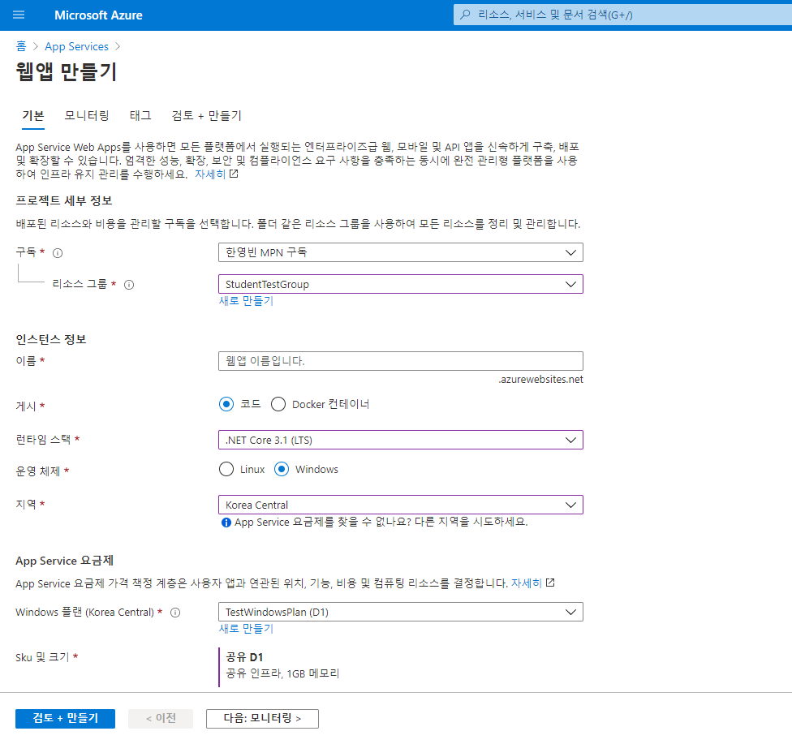

Azure Portal 검색창에서 `App Services` 를 검색하고 들어간 다음, `추가`를 클릭하면 위와 같은 화면이 나온다. 리소스 그룹과 이름을 적절히 지정하고, 
게시는 `코드`로(`Docker 컨테이너`는 여기서 `Dockerfile`를 작성하거나 컨테이너 이미지를 따로 빌드 하지 않았으니 해당사항이 아니다.), 런타임 스택은 우리가 올릴 Swagger Codegen 생성물 기반 코드가 .Net Core 3.1 기준으로 생성 되었으니, `.Net Core 3.1 (LTS)` 항목으로 선택한다. 그리고 앱 서비스 플랜(요금제) 와 서비스 사양도 선택한다. 여기서는 테스트 용도로만 사용할 목적이여서 D1 으로 선택했지만, 실제 서비스로 사용하려면 S1 이상으로 사용해야 한다. 그래야 자동 크기 조정(Autoscale), 앱 백업, 테스트 환경 별도 배포를 위한 스테이징 슬롯 등. 프로덕션 환경 앱 배포를 위한 기능을 사용할 수 있다.


> 위 사진은 S1 요금제가 제공하는 하드웨어 사양과 기능을 보여준다.

App Service 리소스를 생성했다면, 앞서 생성한 Azure Database for MySQL 과의 연결 설정을 먼저 하자. 앞에서 Azure MySQL 에 컴퓨터에서 접속하기 위해 방화벽 설정을 했듯, 이번에는 App Service 에 대해 방화벽 설정을 해야 한다. App Service 리소스의 IP 를 허용해 주면 되는데, 이 IP는 App Service 리소스의 `설정 -> 속성` 화면에 들어가면 쉼표로 구분된 `아웃바운드 IP주소`가 있다. 여기 나온 IP 를 복사해서 Azure Database for MySQL 리소스 연결보안 화면의 방화벽 규칙에 추가하면 된다.


그리고 DB 연결 문자열을 설정하자. 리모트 저장소(여기서는 Azure Repos)에는 연결 문자열 같은 암호나 인증키 등이 포함된 데이터를 커밋하면 안 되므로, 앞서 `appsettings.json` 에 분리한 연결 문자열이 있는 `DatabaseConnection` 의 값을 지워서 비워두고. 이 값을 App Service 리소스의 구성으로 옮길 것이다. 아래 그림처럼 App Service 리소스의 `구성 -> 연결 문자열 -> 새 연결 문자열`로 들어간다.
여기에 이름은 `DatabaseConnection` 앞서 `appsettings.json` 에 있던 연결 문자열 값에 대한 Key 이다. App Service 의 경우 .Net 앱 배포시 연결 문자열로 `appsettings.json`의 `ConnectionStrings` 아래에 있는 키로 설정하면, [App Service 에서 설정한 값이 `appsettings.json` 에 정의한 값을 덮어쓰게 된다.](https://docs.microsoft.com/ko-kr/azure/app-service/configure-common#configure-connection-strings)
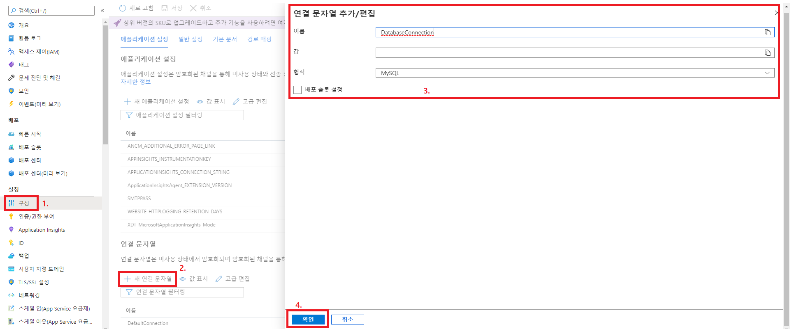

필요한 준비를 다 했으니, 이번에는 Azure Repos 에서 자동으로 배포되도록 설정하자. App Service 화면에서 `배포 센터`로 들어가면 다양한 방식의 배포 옵션을 확인할 수 있다. Azure Repos 뿐만 아니라, 많이 사용하는 GitHub와 Bitbucket 저장소와 연동해서 배포도 가능하며. 로컬 Git 저장소에서 푸시하여 배포하는 방법도 지원한다. 여기서 Azure Repos를 선택하자.

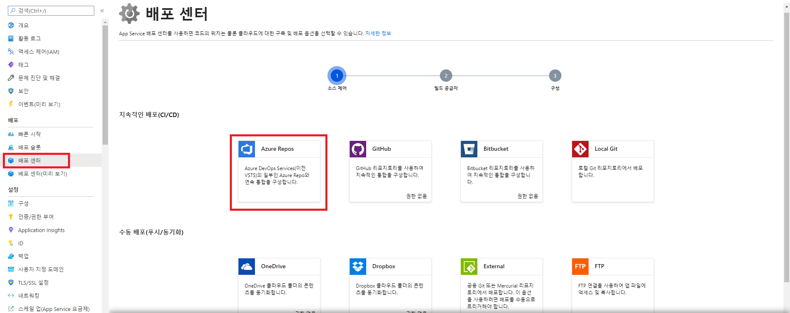

빌드 공급자는 Azure Pipelines 를 선택하자. Azure Pipelines 는 Azure DevOps 에 통합되어 있어서, 각 Azure DevOps 프로젝트에서 파이프라인 작업 현황을 확인할 수 있다. 나중에 필요하면 파이프라인을 수정해서 단위 테스트를 자동화 하거나, 정적 분석 등의 과정을 추가할 수 있다.

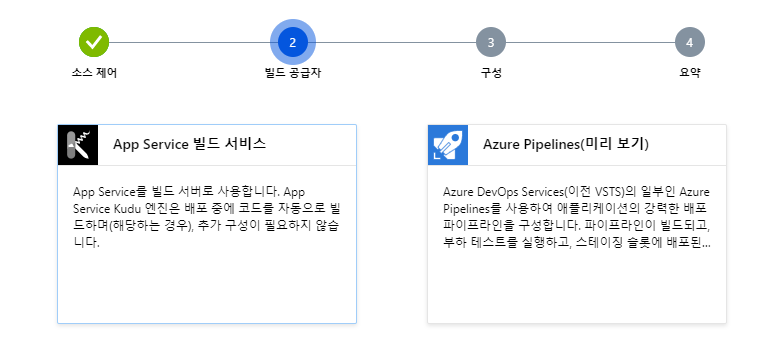

커밋이 올라오면 자동을 배포할 저장소와 저장소의 브랜치(분기) 를 설정해 준다. 그리고 설정을 마무리 하면, 자동으로 배포 파이프라인 구축되어 작동하기 시작한다.


Azure DevOps 에서 배포 설정한 프로젝트의 Pipelines 로 이동하면, 방금 앞에서 배포 설정으로 구성된 파이프라인이 작동하고 있는것을 확인할 수 있다.


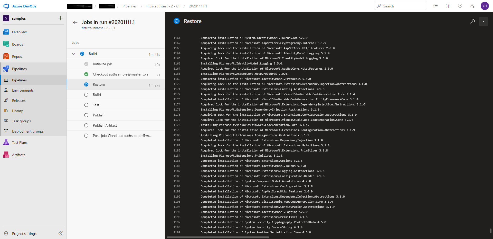

파이프라인 항목으로 들어가서, 수정 화면으로 들어가 보자. 요즘 많은 사람들이 사용하는 GitHub Actions 이 YAML 파일 편집 화면을 보여주는 것과 다르게 GUI 편집 화면이 나오는 데, 이는 클래식 인터페이스로 파이프라인을 구성하는 방식이다. [Azure Pipelines 의 경우 사진처럼 블럭을 끌어나 배치해서 파이프라인을 구성하는 클래식 인터페이스를 사용하는 방법이 있고, GitHub Actions나 기존에 많이 사용하던 Travis CI 처럼 YAML파일로 작성하여 구성하는 두가지 방법이 있다.](https://docs.microsoft.com/ko-kr/azure/devops/pipelines/get-started/pipelines-get-started?view=azure-devops)
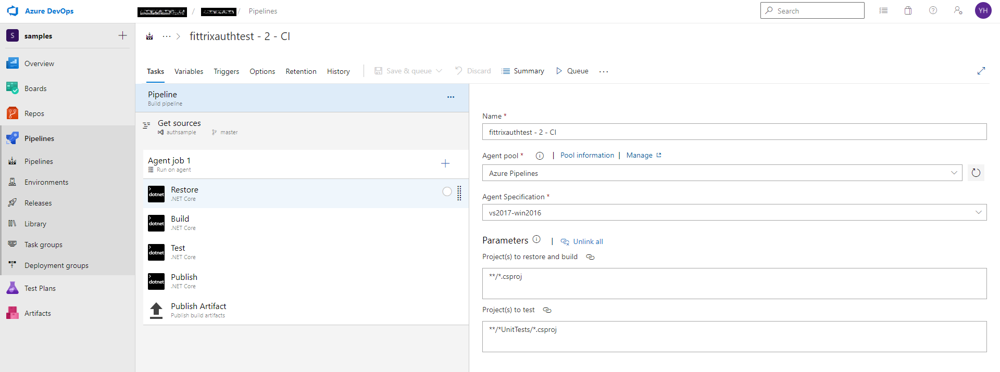

이제 배포도 다 완료 하였으니, 실제 작동하는 것을 확인하자. 앞에서 Swashbuckle을 연동한 것을 기억하는가? API 문서 자동 생성 연동과 그 문서를 볼 URL 까지 설정했기 때문에 바로 볼 수 있다. 
`내_웹사이트_주소/swagger` 로 들어가서 확인해 보자. App Service 로 배포한 앱의 웹 주소는 App Service 리소스 개요 화면에서 확인 가능하다. 예를 들어 `testapi.azurewebsites.net` 면 `testapi.azurewebsites.net/swagger`로 들어가자. Swagger UI 로 생성된 API 문서를 확인할 수 있다.
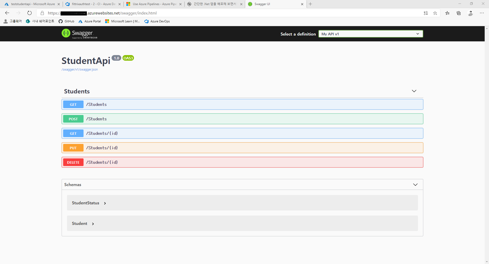

각 API 항목의 `Try it out` 버튼으로 바로 API 테스트 해보는 것도 가능하다.

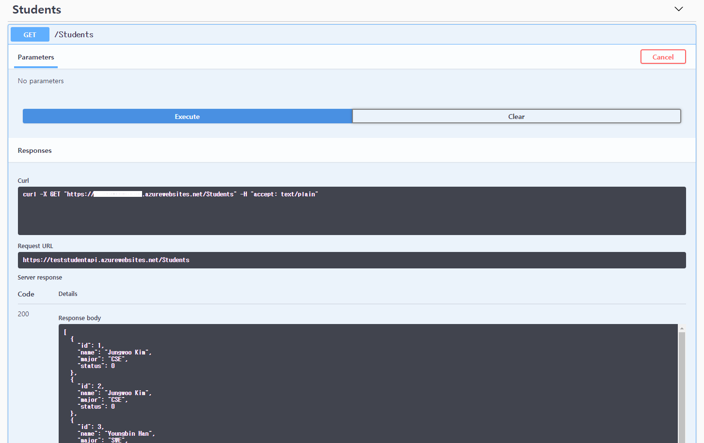

# 인증기능 구현하기
이제 여기까지 했으면 다 했다 싶지만... 그게 아니였다. 고객사에서 전달받은 수정된 서비스 사용 시나리오 문서를 보면서 이상한 점이 몇가지 더 있었는데, 
그 중 하나가 기본적인 인증 기능(가입, 로그인, 로그아웃, 계정 복구)에 대한 설명이 없는 것이였다. 그래서 중간에 컨퍼런스 콜을 통해 이 점을 문의했다. 
회원 데이터가 이미 DB에 저장되어 있다고 가정하고 인증 기능을 넣지 말아야 하는지, 아니면 인증 기능까지 추가로 구현해야 하는지. 
그 결과는... 고객서에서 인증 기능까지 구현해 달라고 한다. (역시 쉽게 끝날리가 없지...)

인증 기능도 직접 다 구현하기 보단, 빠르게 기능을 넣기 위해 이미 존재하는 모듈을 활용하려 했는데, 그러기 위해 [ASP.NET Identity](https://docs.microsoft.com/ko-kr/aspnet/core/security/authentication/identity?view=aspnetcore-5.0&tabs=visual-studio)를 검토했다. ASP.NET Identity 는 기본적인 쿠키 기반 인증 뿐만 아니라, IdentityServer4 기반 OpenID 인증, Azure AD 기반 인증, Azure AD B2C 기반의 소셜 미디어 계정(Facebook, Twitter 등) 인증, App Service 간편 인증 등. 정말 다양한 옵션을 제공한다. 여기서는 사용자 정보를 EF Core 를 통해 저장하는 방식의 기본적인 쿠키 기반 인증만 간단히 다뤄보겠다.

앞에서 작업하던 프로젝트에 몇가지 패키지를 추가하자.
```bash 
dotnet add package Microsoft.AspNetCore.Identity
dotnet add package Microsoft.AspNetCore.Identity.EntityFrameworkCore
```

`Statup.cs` 에서 종속성 주입으로 몇가지 설정을 해야 한다. 먼저 `ConfigureServices()` 에 [`AddDefaultIdentity()` 메소드를 호출하여 쿠키 기반 인증 서비스를 설정한다.](https://docs.microsoft.com/ko-kr/dotnet/api/microsoft.extensions.dependencyinjection.identityservicecollectionuiextensions.adddefaultidentity?view=aspnetcore-5.0#definition) 
```cs
public void ConfigureServices(IServiceCollection services)
{
    ...
    services.AddDefaultIdentity<IdentityUser>()
        .AddEntityFrameworkStores<DatabaseContext>(); // 앞서 만들어 둔 DbContext 연동
    ...
}
```

추가로 각종 인증 정책(암호 정책, 계정 잠금 정책, 사용자 정책 등)을 아래와 같이 설정할 수 있다.  [이 문서](https://docs.microsoft.com/ko-kr/dotnet/api/microsoft.aspnetcore.identity.identityoptions?view=aspnetcore-5.0) 를 참고해서 원하는 인증 정책을 찾아 설정할 수 있다.
```cs
public void ConfigureServices(IServiceCollection services)
{
    ...
    services.AddDefaultIdentity<IdentityUser>()
        .AddEntityFrameworkStores<DatabaseContext>(); // 앞서 만들어 둔 DbContext 연동
    ...
    services.Configure<IdentityOptions>(options =>
    {
        // Password settings.
        options.Password.RequireDigit = true;
        options.Password.RequireLowercase = true;
        options.Password.RequireNonAlphanumeric = true;
        options.Password.RequireUppercase = true;
        options.Password.RequiredLength = 6;
        options.Password.RequiredUniqueChars = 1;

        // Lockout settings.
        options.Lockout.DefaultLockoutTimeSpan = TimeSpan.FromMinutes(5);
        options.Lockout.MaxFailedAccessAttempts = 5;
        options.Lockout.AllowedForNewUsers = true;

        // User settings.
        options.User.AllowedUserNameCharacters =
        "abcdefghijklmnopqrstuvwxyzABCDEFGHIJKLMNOPQRSTUVWXYZ0123456789-._@+";
        options.User.RequireUniqueEmail = false;
    });
    ...
}
```
쿠키 기반 인증이니, 쿠키 보안 정책도 설정해 주자. 쿠키 인증 정책 옵션은 [이 문서](https://docs.microsoft.com/en-us/dotnet/api/microsoft.aspnetcore.builder.cookieauthenticationoptions?view=aspnetcore-1.1) 를 참고하면 된다.
```cs
public void ConfigureServices(IServiceCollection services)
{
    ...
    services.ConfigureApplicationCookie(options =>
    {
        // Cookie settings
        options.Cookie.HttpOnly = true; // 클라이언트 측 JS 에서 쿠키 접근 불허 여부
        options.ExpireTimeSpan = TimeSpan.FromMinutes(5); // 쿠키 유효 시간 설정

        // options.LoginPath = "/Identity/Account/Login"; // 401 오류시 리다이렉트할 경로
        // options.AccessDeniedPath = "/Identity/Account/AccessDenied"; // 403 오류시 리다이렉트할 경로
        options.SlidingExpiration = true; // 쿠키 자동 갱신 설정
    });
    ...
}
```

이번에는 `Configure()` 메소드에 `UseAuthentication()`과 `UseAuthorization()`를 호출해서 인증(Authentication) 및 허가(Authorization) 미들웨어를 설정해 준다.
```cs
public void Configure(IApplicationBuilder app, IWebHostEnvironment env)
{
  ...
  app.UseAuthentication();
  app.UseAuthorization();
  ...
}
```

기존 `DatabaseContext.cs` 를 수정하여 ASP.NET Identity 와 연동하자. 기존 `DbContext`를상속 하던 클래스를 `IdentityDbContext`를 상속하도록 수정한다.
```cs
// 기존
namespace IO.Swagger.Models
{
    public partial class DatabaseContext : DbContext
    {
      ...
    }
}
// 수정
namespace IO.Swagger.Models
{
    public partial class DatabaseContext : IdentityDbContext
    {
      ...
    }
}
```

기본적인 설정은 되었고, 이제 회원가입, 로그인, 로그아웃, 계정 복구 등 각종 인증 관련 API 를 구현해 보자. 인증을 위한 컨트롤러를 구현해서 작업할 것이다.
먼저 아래 코드 처럼, 로그인 관리에 필요한 `SignInManager`, 사용자 관리에 필요한 `UserManager` 를 종속성 주입으로 주입받는다.
```cs
namespace IO.Swagger.Controllers
{

    [ApiController]
    [Route("Auth")]
    public class AuthController : ControllerBase
    {
        private readonly UserManager<IdentityUser> _userManager;
        private readonly SignInManager<IdentityUser> _signInManager;
        private readonly ILogger<AuthController> _logger;

        public AuthController(SignInManager<IdentityUser> signInManager,
           ILogger<AuthController> logger,
            UserManager<IdentityUser> userManager)
        {
            _userManager = userManager;
            _signInManager = signInManager;
            _logger = logger;
        }
    }
}
```

이제 API 함수 하나 만들고, 필요한 데이터를 URL 파라메터나 요청 Body 로 받아서 `SignInManager`의 메소드나 `UserManager`의 메소드를 호출해 주면 된다. 
회원 가입 API 를 예제로 코드를 작성해 보자. 우선 회원가입 데이터 양식을 DTO 코드로 만들어 정의하자. [`DataAnnotation` 특성을 이용하여 유효성 검사를 할 수 있다.](https://docs.microsoft.com/ko-kr/dotnet/api/system.componentmodel.dataannotations?view=net-5.0)
```cs
namespace IO.Swagger.Models.Dto
{
    public class SignUpDto
    {
        [Required]
        public string Username { get; set; }
        [Required]
        [StringLength(100, ErrorMessage = "The {0} must be at least {2} and at max {1} characters long.", MinimumLength = 6)]
        public string Password { get; set; }
        [Required]
        [StringLength(100, ErrorMessage = "The {0} must be at least {2} and at max {1} characters long.", MinimumLength = 6)]
        public string PasswordConfirm { get; set; }
        [Required]
        [EmailAddress]
        public string Email { get; set; }
    }
}
```
그리고 이러한 형태의 데이터를 받아 처리하는 API 를 구현하자. 회원가입은 [`UserManager`의 `CreateAsync()`를 호출하면 된다.](https://docs.microsoft.com/en-us/dotnet/api/microsoft.aspnetcore.identity.usermanager-1.createasync?view=aspnetcore-5.0#definition) 그리고 해당 메소드가 반환한 객체의 `Succeeded` 값이 `true` 인지 확인하여 성공 여부를 확인한다.
```cs
...
public class AuthController : ControllerBase
{
  ...
  [HttpPost("signup")]
  public async Task<IActionResult> SignUp(SignUpDto signUpForm)
  {
      var user = new IdentityUser { UserName = signUpForm.Username, Email = signUpForm.Email };
      var result = await _userManager.CreateAsync(user, signUpForm.Password);
      if (result.Succeeded)
      {
          return Ok();
      }
      return BadRequest();
  }
  ...
}
...
```
# 이메일 발송

회원 가입이 성공이면, 계정 이메일을 인증하는 메일을 발송해야 한다. ASP.NET Identity 가 메일 발송에 필요한 인증 토큰 정도는 생성해 주지만, 메일까지 전송해 주지는 않는다.
그래서 메일 전송 모듈도 하나 따로 붙여줘야 한다. 그리고 메일 발송서비스도 하나 필요하다. 여기서는 SendGrid와 [FluentEmail](https://github.com/lukencode/FluentEmail)로 이를 구성해 보겠다.
SendGrid는 Azure 제공 서비스는 아니지만, [Azure Marketplace 에서 SendGrid 계정을 생성하여 Azure 리소스로 관리가 가능하다.](https://sendgrid.com/docs/for-developers/partners/microsoft-azure/)
SendGrid 계정을 생성하려면, 다른 리소스와 마찬가지로 Azure Portal 통합 검색창에 *SendGrid* 검색하면 바로 나온다. 들어가서 계정 하나 생성하자. 사진처럼 가입 폼이 나오는데, 적절히 입력해 주면 된다.
무료 요금제는 월 25000건이라는 많은 사용량을 제공하긴 하지만, 메일 발송 전용 IP를 제공하지는 않는다. 무료 요금제의 공유IP 로 메일을 발송한다.

중요한 내용의 메일을 꼭 수신자가 수신해야 하는 경우, 유료 요금제 중 전용 IP를 할당해 주는 요금제를 사용하는 것이 좋다.
공유 IP 는 이름 그대로 나만 전송에 사용하는 것이 아니라, 다른 사용자도 메일 발송에 사용하기 때문이다. 물론 SendGrid 의 경우 스팸 전송을 사전에 차단 하겠지만,
만약 다른 사용자가 해당 공유 IP 로 스팸메일을 대량 발송해서 IP주소에 대한 평판(Reputation)이 떨어졌다면, 이메일 서비스 제공자의 메일 서버가 해당 IP 주소를 차단할 수도 있기 때문이다.
메일 서버에서 IP를 차단 하면, 수신자의 스팸함에조차 들어가지 못하기 때문에, 수신자는 발신자가 메일 발송했다는 사실 조차 모른다.
그래서 정말 중요한 메일을 전송 하는 경우, 특히 마케팅 메일 등 다른 목적의 메일도 전송하는 경우, 전용 IP를 제공하는 요금제를 선택하여 용도에 따라 전용 IP 를 두고 사용하는 것이 좋다.
보통 메일 발송 에이전트를 직접 구축해 관리하면 메일 발송 수를 서서히 늘려가던가 하는 방식으로 IP주소 평판을 직접 관리해야 하지만, SendGrid 의 경우 이를 대신 관리해 주기 때문에 편리하다.


계정을 만들었다면, 해당 SendGrid Account 리소스 화면의 `Manage` 버튼을 누르면 로그인 된 SendGrid 관리 화면이 나온다. 
먼저 Sender Identity 인증 및 등록을 통해 메일 발송에 사용할 도메인과 주소를 등록해야 한다. Domain Authentication 으로 도메인 인증을 하고, Single Sender Verification 으로 전송에 사용할 이메일 주소를 만들고 발송자 정보를 인증한다. Sender Authentication 화면은 Settings -> Sender Authentication 에 있다.


먼저 `Authehnticate Your Domain` 을 클릭하여, 도메인 등록과 인증을 먼저 진행하자. 아래 사진과 같은 화면이 나오는데, 본인이 사용하는 DNS 제공자를 선택하자. 본인이 사용하는 DNS 제공자가 없다면 `Other Host`를 선택 후 진행한다.
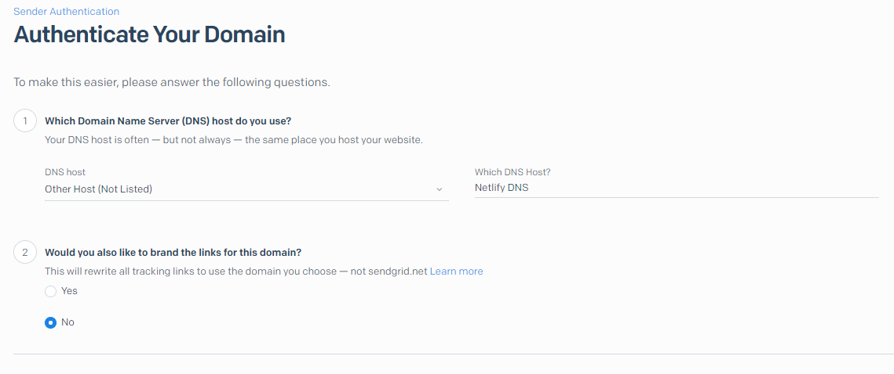

사용할 최상위 도메인(TLD)를 입력한다.

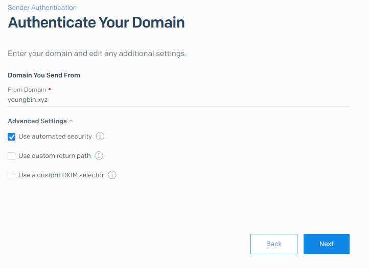

다음 화면에서는 DNS 에 입력해야 할 레코드 정보가 나온다. 나와있는 데로 DNS 레코드를 등록하면 된다. 아래 사진의 경우 CNAME 레코드 3개를 등록하면 된다. 등록 후 `Verify` 를 클릭하여 인증을 진행한다.

> SendGrid 에서 보여주는 등록 DNS 레코드 정보


> Netlify DNS 에 레코드 등록한 모습

다음으로, `Verify a Single Sender` 를 눌러 발송자 정보를 등록한다. 아래와 같은 화면이 나오는데, 발송에 사용할 메일 주소(앞서 등록한 도메인 사용하는 주소)와 발송자 신원 정보 그리고 여기에서 정하는 메일 주소(From Email Address)는 *발신 전용* 주소이기 때문에, 회신 받을 메일 주소(Reply To)도 따로 입력해 준다. [발송자 평판 유지를 위한 절차 중 하나이다.](https://sendgrid.com/docs/ui/sending-email/sender-verification/)


이제 등록과 인증을 마쳤으니, 연동을 해 보자. 대부분의 이메일 발송 서비스가 자체적으로 API 나 SDK 를 제공한다. 이를 사용하는 것도 좋지만, 여기서는 FluentEmail의 SMTP 모듈로 SendGrid 와 연동해 보겠다. API, SDK 는 서비스마다 차이가 조금씩 있겠지만. SMTP 는 프로토콜이니 나중에 필요에 의해 다른 서비스로 옮길때 설정만 조금 수정하면 끝이기 때문이다. 
Email API 아래 Integration Guide 로 이동하여, `SMTP Relay` 를 선택하자.


API Key 이름을 정해서 입력하고 `Create Key` 를 클릭하여 키를 생성하자. 다음 단계에서 SMTP 프로토콜로 SendGrid 메일 발송시 사용된다. 
그리고 아래 서버 호스트네임과 포트, 사용자명 등 인증정보를 확인한다.

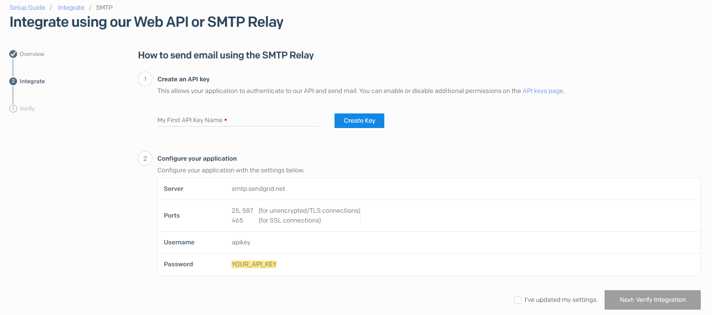

이제 다시 작업하던 .Net 프로젝트로 돌아와서, FluentEmail 패키지를 추가한다. 코어 패키지, SMTP 패키지를 설치했다. 메일 본문을 템플릿 렌더링 하고 싶다면, Razor 패키지를 선택적으로 설치하면 된다.
```bash
dotnet add package FluentEmail.Core
dotnet add package FluentEmail.Smtp
# dotnet add package FluentEmail.Razor
```

역시나 `Statup.cs` 의 `ConfigureServices()` 에서 종속성 주입으로 FluentEmail 을 설정해 주자.
DB 연결 문자열 설정할 때 처럼, `appsettings.json` 에 값을 넣고 불러와서 설정해 주도록 하자.
```json
{
  ...
  "Smtp": {
    "Host": "smtp.sendgrid.net",
    "Port": 465,
    "User": "apikey",
    "Pass": "<API_KEY>",
    "SenderAddr": "noreply@youngbin.xyz"
  }
}

```
```cs
...
public void ConfigureServices(IServiceCollection services)
{
  services.AddFluentEmail(Configuration["Smtp:SenderAddr"]) // 발신자 주소 설정
    .AddRazorRenderer() // 템플릿 렌더링 사용할 경우만 사용
    .AddSmtpSender( // SMTP 서버 설정
      Configuration["Smtp:Host"],
      int.Parse(Configuration["Smtp:Port"]),
      Configuration["Smtp:User"],
      Configuration["Smtp:Pass"]);
}
...
```

앞에서 구현한 회원가입 API 에 이메일 인증 메일 발송 코드를 추가해 보자. 우선 컨트롤러 클래스에 FluentEmail 객체를 주입받아 저장하고.
```cs
public class AuthController : ControllerBase
{
    private readonly UserManager<IdentityUser> _userManager;
    private readonly SignInManager<IdentityUser> _signInManager;
    private readonly ILogger<AuthController> _logger;
    private readonly IFluentEmail _email; // FluentEmail 주입받아 저장할 변수
    public AuthController(SignInManager<IdentityUser> signInManager,
       ILogger<AuthController> logger,
        UserManager<IdentityUser> userManager,
        IFluentEmail email) // FluentEmail 주입받기
    {
        _userManager = userManager;
        _signInManager = signInManager;
        _logger = logger;
        _email = email; // 주입 받은것 저장
    }
    ...
}
```
그리고 인증 토큰을 발급하여, 가입한 사람의 이메일로 전송하는 코드를 추가하자. 가입 성공시에만 전송해야 하니, `result.Succeeded` 가 `true` 일때 메일 발송하도록 하면 된다.
이메일 인증 토큰 발급은 `UserManager`의 [`GenerateEmailConfirmationTokenAsync()`](https://docs.microsoft.com/en-us/dotnet/api/microsoft.aspnetcore.identity.usermanager-1.generateemailconfirmationtokenasync?view=aspnetcore-5.0#Microsoft_AspNetCore_Identity_UserManager_1_GenerateEmailConfirmationTokenAsync__0_) 메소드를 호출하여 생성한다.
```cs
...
[HttpPost("signup")]
public async Task<IActionResult> SignUp(SignUpDto signUpForm)
{
    var user = new IdentityUser { UserName = signUpForm.Username, Email = signUpForm.Email };
    var result = await _userManager.CreateAsync(user, signUpForm.Password);
    if (result.Succeeded)
    {
        // 사용자에 대한 이메일 인증 토큰 발급
        var code = await _userManager.GenerateEmailConfirmationTokenAsync(user);
        code = WebEncoders.Base64UrlEncode(Encoding.UTF8.GetBytes(code));
        // 인증 URL 빌드
        var activateUrl = $"auth/activate/{user.Id}/{code}";
        // 이메일 발송
        await _email
            .To(signUpForm.Email) // 수신자
            .Subject("Verify your account") // 제목
            .Body($"Please confirm your account by <a href='{HtmlEncoder.Default.Encode(activateUrl)}'>clicking here</a>.") // 내용
            .SendAsync(); // 발송
        return Ok();
    }
    return BadRequest();
}
...
```
위와 유사한 방식으로, 적절한 메소드를 호출하여 로그인, 로그아웃, 비밀번호 복구 등을 구현할 수 있다. 이에 사용할 메소드를 조금 나열하자면 아래와 같다.

- [SignInManager](https://docs.microsoft.com/en-us/dotnet/api/microsoft.aspnetcore.identity.signinmanager-1?view=aspnetcore-5.0)
  - [`PasswordSignInAsync()`](https://docs.microsoft.com/en-us/dotnet/api/microsoft.aspnetcore.identity.signinmanager-1.passwordsigninasync?view=aspnetcore-5.0) 암호로 로그인
  - [`SignOutAsync()`](https://docs.microsoft.com/en-us/dotnet/api/microsoft.aspnetcore.identity.signinmanager-1.signoutasync?view=aspnetcore-5.0) 로그아웃
- [UserManager](https://docs.microsoft.com/en-us/dotnet/api/microsoft.aspnetcore.identity.usermanager-1?view=aspnetcore-5.0)
  - [`GenerateEmailConfirmationTokenAsync()`](https://docs.microsoft.com/en-us/dotnet/api/microsoft.aspnetcore.identity.usermanager-1.generateemailconfirmationtokenasync?view=aspnetcore-5.0) 신규회원 이메일 인증토큰 발급
  - [`ConfirmEmailAsync()`](https://docs.microsoft.com/en-us/dotnet/api/microsoft.aspnetcore.identity.usermanager-1.confirmemailasync?view=aspnetcore-5.0) 토큰 제출하여 이메일 인증 처리
  - [`GeneratePasswordResetTokenAsync()`](https://docs.microsoft.com/en-us/dotnet/api/microsoft.aspnetcore.identity.usermanager-1.generatepasswordresettokenasync?view=aspnetcore-5.0) 암호 복구 토큰 발급
  - [`ResetPasswordAsync()`](https://docs.microsoft.com/en-us/dotnet/api/microsoft.aspnetcore.identity.usermanager-1.resetpasswordasync?view=aspnetcore-5.0) 암호 복구(토큰과 새 암호 제출)

이제 배포하기 앞서, 사용자 정보도 DB 에 저장되니 DB 테이블 업데이트가 필요하다. 아까는 DB 서버의 테이블에서 코드를 생성했다면 이번엔 반대로, 코드에서 마이그레이션 코드 생성 후 이를 이용해 테이블을 업데이트 해 줘야 한다. `dotnet ef` 명령을 이용하여 이를 진행하면 된다. 먼저 테이블 업데이트 할 마이크레이션 코드를 생성한다.

```bash
dotnet ef migrations add UserData
```
`appsettings.json` 에 DB 연결 문자열을 설정한 다음, 아래 명령으로 테이블 업데이트를 진행한다.
```bash
dotnet ef database update
```
인증 기능이 포함된 버전을 배포하기 전, 앞에서 DB 연결 문자열을 App Service 구성으로 옮긴 것 처럼, SMTP 설정값도 App Service 구성으로 옮기자.
앞서 `appsettings.json` 에서 아래와 같이 설정했다. `Smtp` 아래에 여러 값이 묶여있는 구조인데, `Parent:Child` 형태로 이름을 넣어서 옮겨주면 된다.
그러면 앞에서 App Service 구성에 설정된 연결 문자열이 실행 시 덮어쓰는 것 처럼, [아래 설정값도 실행 시점에 App Service 구성에 설정된 값으로 덮어씌어진다.](https://docs.microsoft.com/ko-kr/azure/app-service/configure-common)
```json
{
  ...
  "Smtp": {
    "Host": "smtp.sendgrid.net",
    "Port": 465,
    "User": "apikey",
    "Pass": "<API_KEY>",
    "SenderAddr": "noreply@youngbin.xyz"
  }
}

```

| 이름 | 값 |
| -- | -- |
| Smtp:Host | smtp.sendgrid.net |
| Smtp:Port | 465 |
| Smtp:User | apikey |
| Smtp:Pass | SendGrid 에서 발급한 API Key |
| Smtp:SenderAddr | noreply@youngbin.xyz |

# API Management
이번에는 App Service 를 [API Management](https://docs.microsoft.com/ko-kr/azure/api-management/api-management-key-concepts) 와 연동해 보겠다.
Azure API Management 는 API Gateway, API 관리 포탈, 개발자(API 사용자) 포탈을 통합한 제품이다. API 통합을 하거나, API 호출 건수 등으로 과금을 하는 API 상품을 만들 수도 있고, 백엔드 수정 없이 동작을 따로 정의해 적용하여 프로토타이핑도 가능하다. 일단 당연히 API Management 리소스를 하나 생성해야 하는데, 생성 완료까지 **30분** 넘게 걸린다. 리소스 배포하는 30분 동안 커피 한 잔 떠다가 마시면서 느긋하게 기다리도록 하자. 리소스 생성은 아래 그림을 참고해서 생성하면 된다. 참고로 개발자 요금제는 SLA 가 없다. 서비스 장애에 대해 보상이 없다는 의미이다. 프로덕션에 사용할 경우 SLA 보장 요금제를 선택하여 리소스를 생성하도록 하자. 요금제 잘못 선택해서 삭제하고 다시 만들면 30분 또 기다려야 한다.


긴 시간 기다려서 드디어 API Management 인스턴스가 생성 되었다면, 해당 리소스 화면의 `API` 화면으로 가서 바로 앞에서 배포한 App Service 리소스를 연결하자.
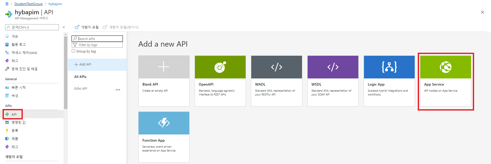


필요한 경우, URL 접미사를 붙여 Base URL 에 경로를 추가하여 구분하도록 설정이 가능하다.
그렇게 해서 연결된 앱 서비스에 나오는 API 목록은 앞에서 구현한 백엔드의 API 와 다름을 할 수 있다. 
Operations 탭의 All operations 를 누르고, `Frontend` 영역의 편집 버튼을 눌러 OpenAPI 명세 편집기를 열어 앞에서 구현한 백엔드의 명세로 교환하자
 

앞서 배포한 App Service URL 에 `/swagger` 를 붙이고 들어가면  Swagger UI 가 나오는데, JSON 명세를 여는 링크가 페이지 상단에 있다. 이를 눌러 나오는 JSON 형식의 명세에서, `paths` 부분부터 나오는 내용을 복사해서 Azure 쪽에 있는 내용을 바꾸면 된다.
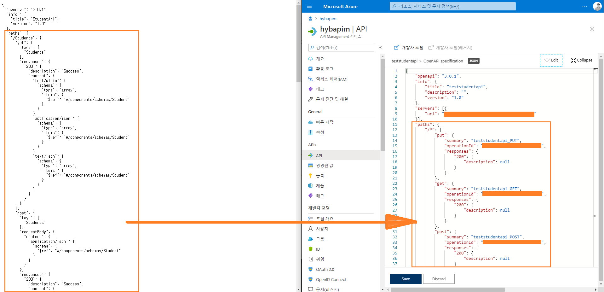

Settings 탭으로 가서, `Subscription required` 를 체크 해제 하고 저장하도록 하자. 이 기능은 개발자 대상으로 Open API 구독 상품을 만들 때 사용하는 기능이여서,
지금처럼 내부적으로만 사용할 API에 이 기능을 사용할 이유가 없다. Test 탭으로 이동하면, Swagger UI 에서 API 바로 실행해서 테스트 해 볼 수 있듯 여기서도 바로 테스트 해 볼 수 있다.


모니터링 아래에 "분석" 화면으로 들어가면, API Management 에 연결된 여러 API 백엔드에 대한 API 호출 기록과 그 분석을 통합해서 볼 수 있다.
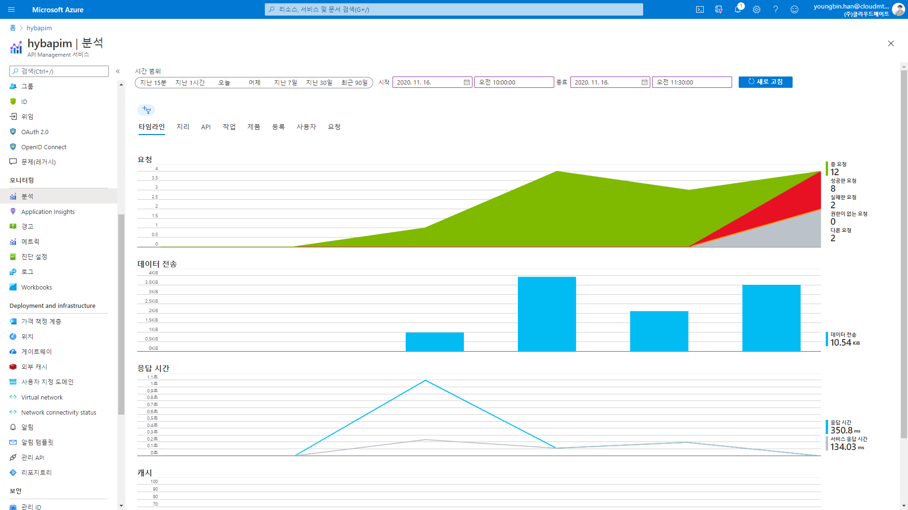
통합 되어있는 API 백엔드 별로 통계를 볼 수도 있고, 모든 API 백엔드의 API 엔드포인트별로 보거나, 통합된 API 백엔드에서 발생한 API 호출 내역을 하나의 목록으로도 볼 수 있다.
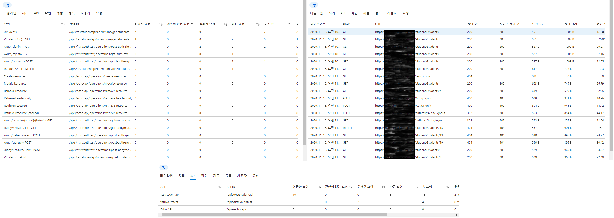

# Azure Front Door
마지막으로, API Management 앞에 Front Door 를 붙여보고 마무리 하도록 하겠다. Azure Front Door 에 대한 소개는... 이번에는 Microsoft 문서에서 발췌해 보았다.

> Azure Front Door는 Microsoft 글로벌 에지 네트워크를 사용하여 빠르고, 안전하고, 확장성이 뛰어난 웹 애플리케이션을 만들기 위한 확장 가능한 글로벌 진입점입니다. Front Door를 사용하면 글로벌 소비자 및 기업 애플리케이션을 글로벌 Azure 잠재 고객에게 도달하는 콘텐츠가 있는 견고한 고성능의 맞춤형 최신 애플리케이션으로 변환할 수 있습니다.
> - [Azure Front Door 란?](https://docs.microsoft.com/ko-kr/azure/frontdoor/front-door-overview)

문서를 좀 더 읽어보면서 이해한 것을 바탕으로 좀 쉽게 설명하자면, 전세계 어디서든 Azure 에 호스팅 한 웹 앱에 빠르게 접속 할 수 있도록 해 주는 제품 정도로 설명할 수 있다. 동일한 웹 앱이 여러 리전에 배포되어 있다면, 사용자를 그중 가장 빠르게 접속 가능한 쪽으로 라우팅 해 주는 것이 주요한 기능이고, 여기에 웹 애플리케이션 방화벽(WAF), DDoS 보호등 다양한 보안 기능까지 통합된 제품이다.
전 세계 타겟으로 하는 서비스라면 이 제품이 유용하지만. 국내 사용자만 대상으로 하는 경우 등, 단일 지역만 대상으로 하는 서비스에는 Load Balancer 또는 Traffic Manager 가 더 적합하다. [이 문서](https://docs.microsoft.com/ko-kr/azure/architecture/guide/technology-choices/load-balancing-overview)를 참고하면, Front Doot 등 다양한 부하분산 옵션 중 적합한 것으로 선택하는 데 도움이 된다.

리소스 생성을 시작하면 Front Door 디자이너가 나온다. 프런트엔드/도메인 부터 백엔드 풀, 회람 규칙 까지 순서대로 설정하면 된다.


프런트엔드/도메인 부분은 Front Door 의 호스트 이름(접속 주소)와 방화벽 정책 등을 설정한다. 방화벽은 정책이 미리 만들어져 있어야 설정 가능하니 지금 단계에서는 생략하고 진행한다.


백엔드 풀 에서는 Front Door 뒤에 붙을 백엔드를 설정한다. 하나 이상의 여러 백엔드를 연결하여 풀을 형성할 수 있다. 그러면 Front Door 에서 [Health probe](https://docs.microsoft.com/ko-kr/azure/frontdoor/front-door-health-probes)를 통해 최상의 백엔드 리소스를 결정하여 라우팅 한다.
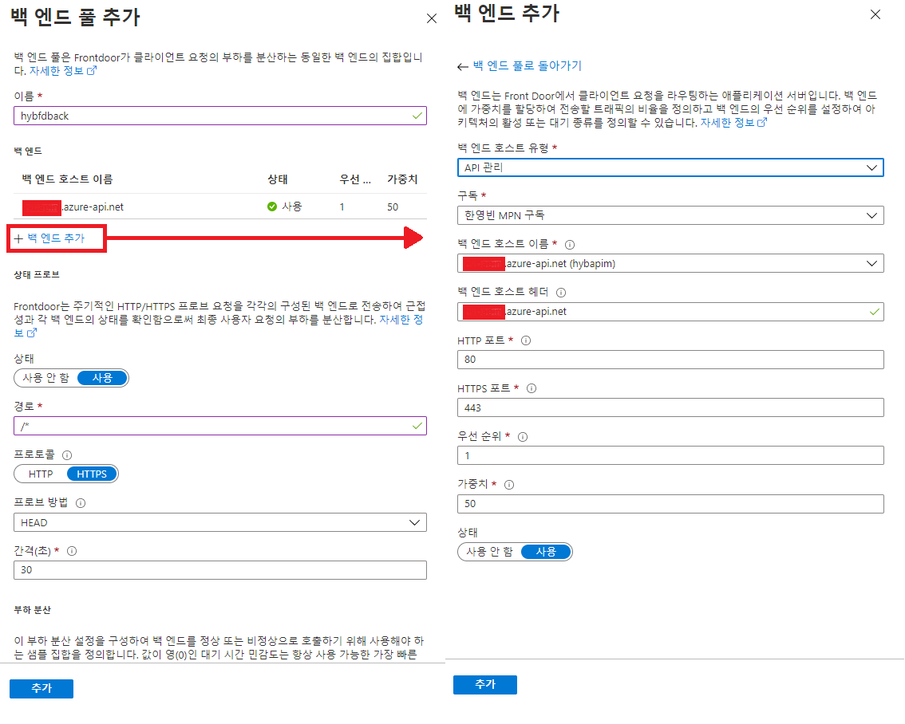

마지막으로 회람 규칙(라우팅 규칙)에서 라우팅 설정을 하고 리소스 생성을 마무리 한다.
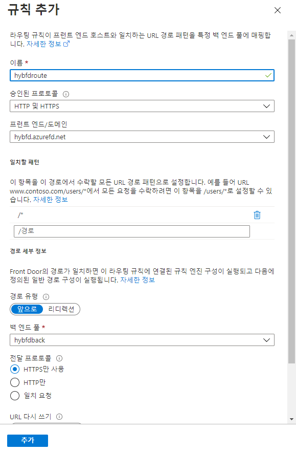

Front Door에 설정할 WAF 정책을 생성하여 설정해 보자. Front Door 용 WAF 정책을 선택하고 계속한다.
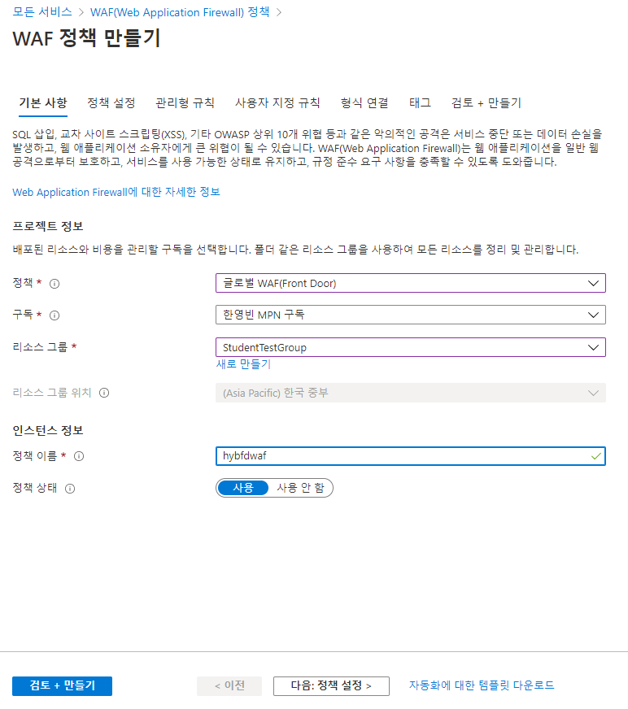

WAF 정책 생성 중 볼 수 있는 관리형 규칙 선택 화면이다. OWASP Top 10 에 정의된 웹 취약점에 대한 공격을 방어하는 방화벽 정책이 미리 준비되어 있어, 이를 그대로 사용할 수 있다.
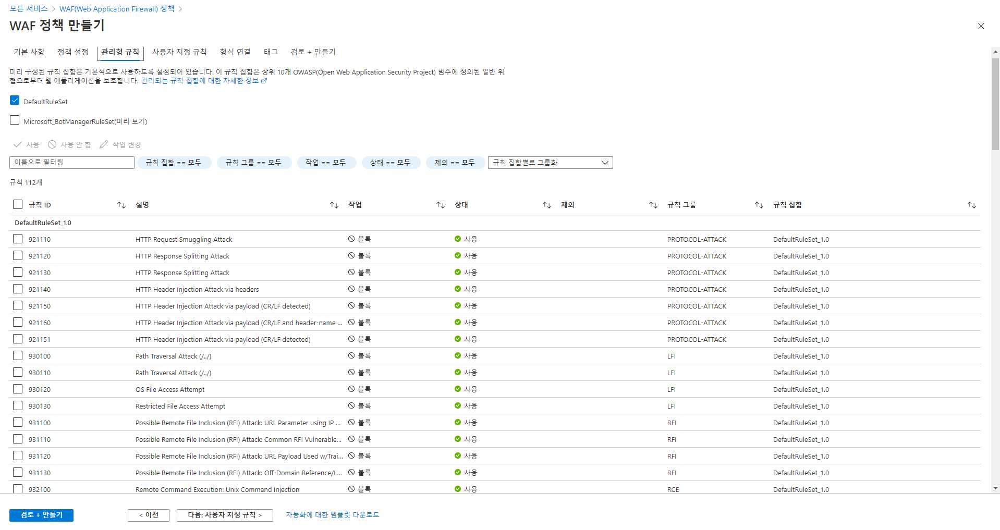

형식 연결 단계에서 앞서 생성한 Front Door 리소스와 연결 설정을 해 준다.
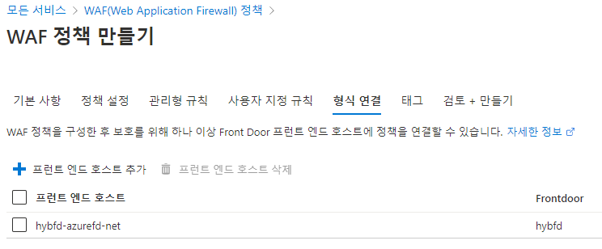

# 결론
자. 지금까지 다룬 내용을 그림 하나와 몇 줄의 설명으로 요약해 보자.
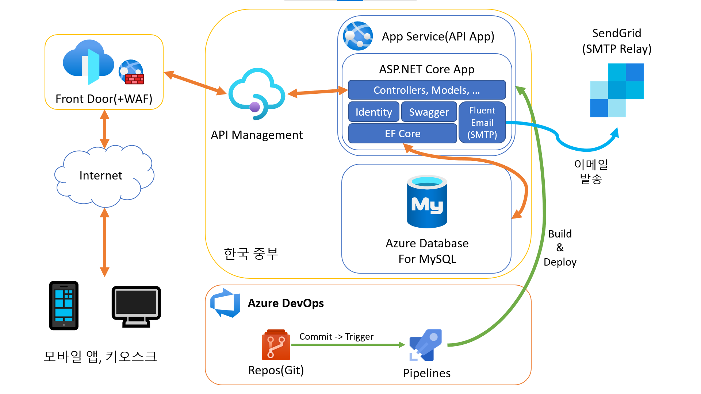

중간에 고객사와의 계약이 틀어져서 실제로 프로덕션에 올리진 못했지만, 위 그림과 같은 구조의 백엔드 개발과 인프라 설계를 검토했다.
- 널리 쓰이는 프레임워크 및 라이브러리와, 코드 자동 생성을 통한 빠른 앱 백엔드 개발
  - ASP.NET Core, Swagger, .Net Identity, EF Core, FluentEmail 등 필요 기능이 미리 구현된 모듈 활용
  - EF Core CLI 의 DB Scaffold 기능과 Swagger Codegen을 통한 코드 자동 생성
- App Service, Azure Database for MySQL 을 이용한 기본적인 백엔드 배포
- SendGrid 를 활용한 사용자 인증메일 발송
- Azure DevOps 를 이용한 소스코드 형상관리(Azure Repos)와 빌드 및 배포 자동화(Azure Pipelines)
- API Management 를 이용한 여러 API 백엔드 통합
- Front Door, WAF 연동을 통한 전세계 다양한 지역 사용자 빠른 서비스 제공과 웹 앱에 대한 공격 보호

전반적으로 사용된 제품이나 서비스를 보면 알 수 있는 공통점은, 대부분 관리형 서비스를 이용하여 구성했다는 점 이다. 
여기서 직접 개발하거나, 직접 프로그램을 설치해서 구성한 것은 ASP.NET 백엔드 뿐 이다. 사실 가상머신에 직접 관련 프로그램을 설치하여 구성하는 것도 불가능한 것은 아니다. 
인프라를 손으로 하나하나 완전히 제어하고 싶다면, 가상머신 등 IaaS 위주로 활용하는 것이 좋을 수도 있다.
클라우드 서비스가 제공하는 제품 중 관리형 서비스 제품을 활용하여 서비스를 구축하는 이유는 무엇일까? 
웹 백엔드를 개발 할 때 프레임워크를 직접 개발해 쓰는것이 아닌, 이미 널리 쓰이는 프레임워크나 라이브러리를 활용하여 빠르게 개발하는 것과 비슷하다.
이 글에서 언급한 고객사의 경우 개발자나 엔지니어 인력이 내부에 없고, 새로운 서비스를 빠르게 출시 해야 하는 상태였다.
그러한 상황에서 관리형 서비스를 활용하여 구축하면, 필요한 모든것이 미리 다 구축되어 있는것을 결합해서 구성하기 때문에 서비스 구축에 많은 시간을 절약할 수 있다.
관리 부담도 크게 줄일 수 있다. 직접 구축했을 때 다루기 어려운 부분을 클라우드 제공자가 대신 다뤄주기 때문이다.

이 글에서 나온 몇몇 제품을 사용하지 않고 직접 구축한다고 상상해 보자.
- App Service: 배포할 앱의 실행 환경, Auto Scaling, 자동 백업, OS 업데이트를 모두 직접 구축하고 관리해야 한다.
- Azure Database for MySQL: 데이터베이스 서버 설치는 물론, 자동 백업, 하드웨어 및 OS 유지보수, 고가용성 모두 직접 구축하고 관리해야 한다.
- Azure DevOps: GitHub, Azure DevOps등 준비된 서비스를 사용하지 않고, 사내에 직접 구축한다면? [GitLab 설치 문서](https://docs.gitlab.com/ee/install/README.html)를 보며 한번 상상해 보자.
- SendGrid: 메일 발송 서버 구축과 관리도 문제지만, 메일 전송에 쓸 IP 평판 관리에서 시간이 많이 필요하다. IP 평판이 낮으면 여러분이 발송한 메일은 수신자의 스팸함에조차 도달하지 못한다.
- Front Door: 지출 가능한 비용과 시간이 많다면 가능은 하겠지만... 빠른 시일 내에 서비스 출시가 필요하다면, 이런걸 짧은 시간안에 직접 구축하는건 어렵다고 봐야 한다.

뿐만 아니라 SLA(사용자 수준 계약)까지 제공한다. 무료 요금제에서부터 제공하는 제품도 있고 특정 단계 이상의 요금제를 선택하면 제공하는데, SLA 보장을 기본적으로 해 줄 정도로 서비스 안정성에 자신이 있다는 것이고, 그정도로 노하우도 많다는 것이다. 물론 직접 구축하는 것과 비교하면 금전적 비용이 많이 나간다. 하지만 클라우드 제공자가 미리 구축한 자원과 노하우를 그대로 가져다 바로 쓸 뿐만 아니라 자동 관리에 안정성 보증까지 받는다 생각하면 비싸다고 하긴 어렵다. 이렇게 클라우드 서비스의 관리형 서비스를 잘 활용하면, 짧은 시간 안에 개발과 출시가 필요한 서비스를 위한 인프라 구축을 위해 시간을 단축할 수 있을 뿐만 아니라 이후 관리 부담까지 줄일 수 있는 장점이 있다.