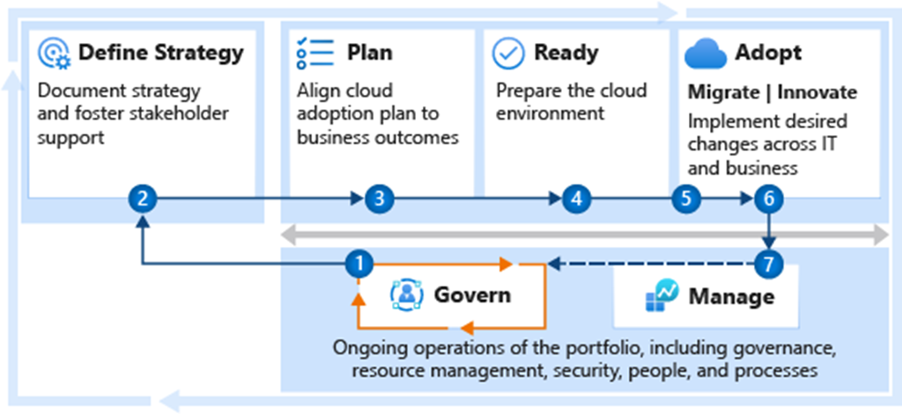

우선 방금의 문장에서 어떠한 인물을 떠올렸다면... 
본인의 과거를 돌아보며 반성하시기 바란다. (본인 포함해서...) 
 

## 인류는 항상 예산과 싸웠다.
어느 시대에 살든 어떠한 정부형태를 가졌든 얼만큼의 경제력을 갖추었든 간에 인류는 항상 예산과의 싸움이 시달렸었다. 
그건 코로나시대 (COVID Era)에도 현재 진행형이고 앞으로도 계속 될 것이다. 

결국 어느 기업이던 간에 항상 고민하게 되는 부분은 "비용을 어떻게 줄일 수 있을까?" 
"어떻게 하면 획기적으로 줄일 수 있을까?등을 고민하게 된다. 
당장 우리들만 봐도 "전기세를 어떻게 아낄 수 있을까?"라고 고민하지 않는가? 

그렇다면 클라우드 서비스에서는 어떻게 해야 가장 적절하게 비용을 최적화 시킬 수 있을까? 
 

## 그렇다면 클라우드와 비용의 관계는?

가장 기초적인 시작은 거버넌스의 위치가 얼마나 적절한지 부터 파악하는 것이다. 
클라우드 구성을 계획하고, 그 계획을 비즈니스와 어떻게 접목 시킬 것이며, 실제로 배포 및 구동을 전개 하고,  
전개된 구성에 대한 매니지먼트와 거버넌트를 다시 확인 하는것이 비용을 최적화 시킬 수 있는 방법이다. 
 

사람에 따라서 기업에 따라서 부르는 용어는 모두 다를 수 있지만 
클라우드 기업들의 대부분은 세 팀으로 나눠져 있음을 알 수 있었다. 

1. 클라우드 전략 팀
2. 클라우드 관리 팀
3. 클라우드 수용/적용 팀

* 클라우드 전략 팀
    - 클라우드 전략 틈은 리더의 위치로써 대략적은 예산을 편성하고,  
    예상 지출 및 예상 투자수익율(ROI)을 산출하여 예산을 집행한 후 비용의 대한 결과 또한 리뷰 한다.

* 클라우드 관리 팀
    - 클라우드 관리 팀은 전반적인 클라우드 포트폴리오(Cloud Portfolio)에 대한 비용을 관리 한다. 
    예를 들어, 클라우드 환경의 대한 최적화와 퍼포먼스 텔레메트리(Performance Telemetry)를 통해서 비용을 최대한 절감시키기 위해 노력한다.

* 클라우드 수용/적용 팀
    - 마지막으로 클라우드 수용/적용 팀은 최전방을 수호하는 전선이라고 보면 되겠다. 
    클라우드 관리 팀과 협업(을 반드시 해야)하며, 클라우드 전략과 관리 팀에서 책정한 예산과 테스크를 직접 진행하며, 
    최대한 적은 예산으로 높은 효율을 도모해야 하는 일을 수행한다고 보면 된다. 

더 자세한 설명은 다음을 참고 하면 더욱 도움이 될 것이다. 

더 알아보기: [Microsoft Azure: Build a Cost-Conscious Organization](https://docs.microsoft.com/en-us/azure/cloud-adoption-framework/organize/cost-conscious-organization) 
 

## 운영 및 실무비용의 최적화

앞서 거론했듯이, 클라우드 관리팀은 환경의 대한 최적화에서 비용을 최대한 절감시킨다고 했다. 
클라우드 수용 팀과 협업(을 반드시)하여 가장 적절한 소스를 가져와서 부족한 부분은 채우고 
필요 없는 부분은 과감히 배제하는 역할이 필요 하다. 

몇 가지 최적화 예시를 소개하자면: 

Tagging: 리소스들의 대한 태그를 정확하게 명시하여 분류하기 쉽게 만든다.  

Licensing: 가장 적합한 유틸리티와 적절한 라이선스 사용으로 비용을 상대적으로 줄일 수 있다. 

Bulk Shutdown: 쓰지 않는 대량의 리소스들을 사용 종료(Shutdown) 시킴으로 비용을 줄일 수 있다. 

Bulk Right-sizing: 리소스 크기를 적절하게 줄여 가장 최소의 SKUs를 사용할 수 있도록 유도.  
 
클라우드 수용/적용 팀에 대한 최적화는 대표적으로 다음과 같다.

Autoscaling: 자동화 시스템을 사용하여 리소스의 과다 사용 및 크기 조정을 더욱 수월하게 해 줄 수 있다. 

아키텍처 수정: 서버리스(Serverless) 기술 등을 사용하여 기존에 사용하던 아키텍처를 수정함으로써 비용을 효과적으로 줄일 수 있다. 

이 외에도 다양한 방법으로 비용을 최적화할 수 있지만, 
[Cost Management Tools in Azure](https://docs.microsoft.com/en-us/azure/cloud-adoption-framework/govern/cost-management/toolchain) 이나 [Microsoft Azure Advisor](https://azure.microsoft.com/en-us/services/advisor/) 에서 더 자세하게 볼 수 있다.  
 

지출 비용을 줄이는 건 언뜻 보기에는 쉬워 보이기도 하지만 (뭐... 실제로 익숙해지면 쉽다), 
가장 복잡하고 가장 머리를 많이 써야 하는 일이 바로 지출 비용의 최적화다. 

괜히 세상에서 어려운 게 돈 버는 게 아니라 돈을 줄이는 거라고 했던가...

어쩌면 그냥 다이어트보다 더 어려운 게 예산 다이어트 아닐까?